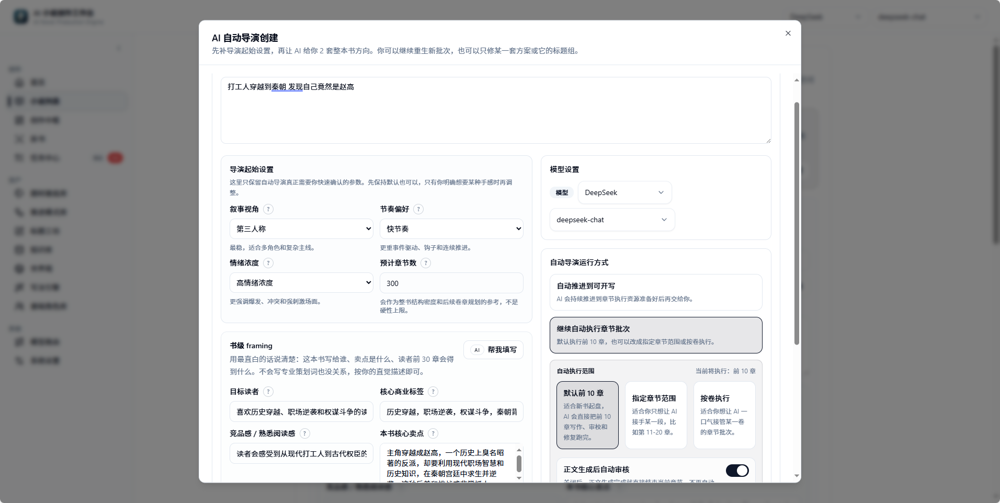

# AI 小说创作工作台 / AI Novel Production Engine
一个面向长篇小说创作的 AI Native 开源项目。

当前开发主线：
`Creative Hub + 自动导演开书 + 整本生产主链 + 写法引擎`


## ✨ 项目简介

这是一个**面向长篇小说的 AI 生产系统**。

它不再是“你写一句，AI补一句”的聊天模式，而是：

- 👉 从一个想法出发
- 👉 自动构建世界观、人物、剧情结构
- 👉 管理知识与设定（RAG）
- 👉 控制写作风格与叙事一致性
- 👉 最终生成完整章节甚至整本小说


## 项目定位

很多 AI 写作工具的使用方式其实差不多：
- 你输入一句 Prompt
- 它回你一段正文
- 不满意就重试
- 写短篇还行，写长篇容易越写越散

这个仓库是“AI 导演式长篇小说生产系统”，而不是传统的写作聊天壳子。

它最核心的产品判断是：

- 目标用户优先是完全不懂写作的新手，而不是熟悉结构设计的资深作者。
- 优先解决“如何把整本书写完”，再逐步优化“写得多精巧”。
- AI 不只是一个补全文本的模型，而是参与规划、判断、调度、执行和追踪的系统角色。

如果你正在找的是下面这种项目，这个仓库会更值得关注：

- 想验证 AI 是否真的能参与整本小说生产，而不是只写单段文案。
- 想研究 AI Native Product、Agent Workflow、LangGraph 编排怎样落到真实创作业务。
- 想把世界观、角色、拆书、知识库、写法控制和章节生成串成一套稳定工作流。


## 现在已经能做什么

### 1. AI 自动导演开书

- 可以从一句模糊灵感直接进入自动导演，不必先自己把世界观、主线、角色和卷纲全想完；系统会先整理项目设定、对齐书级 framing，再生成多套整本方向和对应标题组。
- 方案选择不再只是“满意就确认、不满意就整批重来”。如果第一轮方向不够准，可以继续生成下一轮；如果已经偏向某一套，也可以只让 AI 修这套方案，或者只重做这套的标题组。
- 自动导演创建时已经支持三种推进方式：`按重要阶段审核`、`自动推进到可开写`、`继续自动执行前 10 章`。对应链路会把书级方向、故事宏观规划、角色准备、卷战略、节奏拆章和章节执行接成一条连续流程。
- 这条链路已经支持检查点恢复、现有项目接管、页内继续推进和换模型重试。到 `front10_ready` 之后，不仅能直接进入章节执行，也可以继续让 AI 自动执行前 10 章的写作、审校和修复。
- 自动导演里的角色阶段也不再无条件把第一套阵容直接落库。现在会优先生成可直接进入正文的人物资产；如果角色名仍像功能位、缺少身份锚点或质量不够稳定，系统会停在角色审核点，而不是继续把坏阵容带进后续卷规划和拆章。

### 2. Creative Hub 与 Agent Runtime

- `Creative Hub` 现在已经不只是一个聊天页，而是在往统一创作中枢收：对话、追问、规划、工具调用、执行状态和回合总结都在往这里并。
- 系统里已经有了比较明确的 Planner、Tool Registry、Runtime、审批节点、状态卡片和中断恢复链路，说明这个项目现在关注的已经不是“AI 会不会写字”，而是“AI 能不能组织一条真实的创作工作流”。
- 如果你关心的是 AI Native Product 怎么落地，这一块已经不是零散按钮拼盘了，而是开始长出一套值得继续往下做的骨架。

### 3. 整本生产主链

- 单章运行时、章节执行和整本批量 pipeline 现在都在往同一条主链上收，不再是“这里一个试写入口，那里一个批量按钮”的割裂状态。
- 已经可以从结构化规划、章节目录和资产准备状态出发，启动整本写作任务，并持续查看当前阶段、失败原因和下一步建议。
- 它当然还不是那种完全不用管的一键出书机，但也已经不是“只能演示几张截图”的阶段了，至少主链是真的能往前推。

### 4. 写法引擎

- 写法现在不再只是提示词里的一段长说明，而是可以保存、编辑、绑定、试写和复用的长期资产。
- 可以从现有文本里提取写法特征，并把原文样本一起保存下来，后面不是只能靠记忆去猜“当时那个味道到底怎么来的”。
- 提取出来的特征会沉淀成可见特征池，进入编辑页以后可以逐项启用、停用和组合，写法规则也会跟着同步重编译，便于后续试写、修正和整本绑定。
- 这意味着写法引擎现在已经开始真的参与生成、检测和修正链路，而不是一个摆在侧边栏里的概念功能。

### 5. 世界观、角色、拆书、知识库联动

- 世界观已经不只是大段设定文本，而是支持创建、分层设定、快照、深化问答、一致性检查和小说绑定的结构化资产。
- 角色体系也不再只是静态角色卡，已经开始往动态角色资产走，会把关系阶段、卷级职责、缺席风险和候选新角色一起带进后续规划与生成。
- 拆书结果可以继续发布到知识库，再回灌到续写、规划和正文生成；知识库本身也已经支持文档管理、向量检索、关键词检索和重建任务追踪。
- 换句话说，这一块现在已经开始像“长期记忆系统”，而不是做完一次设定就丢在那里的资料堆。

### 6. 模型路由与本地运行

- 已经支持 OpenAI、DeepSeek、SiliconFlow、xAI 等多提供商配置，规划、正文、审阅这些链路可以按路由拆开配。
- 前后端已经完成 Monorepo 拆分，适合本地持续开发，也比较适合继续往 Prompt Registry、Workflow Registry 和 Runtime 这条路上扩。
- 默认使用 SQLite 就能把主链先跑起来；如果你要完整体验知识库 / RAG，再按需接 Qdrant 就行，不需要一上来就把所有基础设施堆满。


## 典型使用路径

1. 在小说创建页输入一句灵感，先让 AI 自动导演给出整本方向候选。
2. 进入 `项目设定`，先把题材、卖点、目标读者感受和前 30 章承诺定下来。
3. 用 `故事宏观规划`、`角色准备` 和世界观资产，把整本主线、角色网和世界边界补到能写。
4. 进入 `卷战略 / 卷骨架` 决定怎么分卷，再到 `节奏 / 拆章` 把当前卷落到章节列表和单章细化。
5. 按需绑定拆书结果、知识库文档和写法资产，让后续正文不只是靠一次性提示词。
6. 进入 `章节执行` 逐章写作、审计、修复，必要时回到卷工作台做再平衡和重规划。
7. 想加速推进时，再启动整本生产任务，持续查看状态、失败原因和回灌结果。

## 当前长篇生成能力支撑图


- 开书定盘负责先把这本书“要写成什么样”说清楚，避免后面越写越散。
- 整本控制层和卷级规划层负责把长篇拆成可推进、可回看、可调整的结构，而不是一次性写死。
- 角色、世界观、写法、知识库和质量控制一起托住单章生成，让每一章都尽量还在同一本书里。
- 每写完一章，系统都会把新状态回灌回去，继续影响后续章节、卷级节奏和必要时的重规划。

## 最近进展

### 2026-04-09

- 自动导演在“生成书级方案”这一步如果遇到结构化输出失败，现在会直接把任务标成失败，而不是长时间卡在 `10%` 看起来像还在运行；候选阶段也会把当前绑定模型和恢复上下文一起记进任务信息，任务中心里能更准确看到这次导演实际绑定的模型，并支持在服务重启后继续把这一步接起来。
- 任务中心现在不会再把章节实时生成留下的内部轨迹任务混进全局任务列表；同一本书在跑自动导演或批量执行时，不会再额外冒出几张“章节 X 生成”的误导性运行卡片。
- 小说列表导出正文时，文件名现在会优先使用“小说名 + 导出时间”；就算下载响应头被代理层吃掉，前端也会用同样的规则兜底，连续导出多份时更容易区分版本。
- 系统设置里的模型路由页现在不只看“能不能连上”，还会把普通连通和结构化调用分开诊断；像当前用了哪种结构化策略、是否强制关闭 thinking、有没有可接管的结构化备用模型，都会直接显示出来，排查“为什么这家模型能聊天却老是出不了稳定 JSON”会直观很多。
- 结构化任务新增全局“备用模型”配置。当前模型如果出现原生 JSON 不兼容、思考内容污染、JSON 截断或结构不匹配，系统会先尝试更保守的结构化策略，再按配置切到备用模型，像规划、标题、题材生成、拆书这类依赖结构化输出的链路不再那么容易因为单个模型不稳就整段卡死。
- 模型选择器现在只展示已经配置、启用且确实有可用模型的厂商；如果当前还没有可运行模型，也会明确提示先去系统设置补配置，不再把一堆实际上不能用的 provider 混在下拉框里让人试错。
- 拆书任务的状态和失败提示更贴近真实执行了：后台只要还有心跳，任务中心就不会长期把其实已经在跑的拆书误显示成排队中；遇到结构化输出类错误时，也会尽量翻译成更容易读懂的失败原因。拆书分析本身也补强了中文章节识别、读者信号 / 短板信号提炼和总览分析稿结构，复盘时更容易看出这本书到底强在哪、弱在哪。

### 2026-04-08

- 模型配置页现在内置支持 `MiniMax`，可以像其他主流服务商一样直接配置 API Key、模型和连接信息，不用再手动把它当成泛化兼容接口来接。
- 每个模型服务商卡片上都新增了独立的“思考功能”开关，而且默认开启；如果你只想看最终正文、不想在界面里看到思考内容，现在可以按服务商分别关闭。
- 对 `MiniMax M2.*` 这类会把思考内容混进正文的返回格式，系统现在会自动做分离和清洗；关闭思考显示后，正文区域不会再把 `<think>` 这类内容直接漏出来。
- 章节执行流里，“先生成执行计划”之后会立刻把这一章推进到可写正文状态，并同步刷新界面提示；不需要再手动猜下一步该点哪里，计划出来后就能继续“写本章”。
- 章节正文在实时输出结束后，现在会明确切到“收尾中”而不是继续显示“写作中”；系统会把保存草稿、审计和状态同步这段收尾过程单独标出来，章节队列也会更准确地切到待审校或待修复，不再让人误以为正文还没写完。
- 自动导演在新建小说和接管现有项目时，现在都不再只能固定执行“前 10 章”。除了默认前 10 章，你也可以直接指定章节范围，或者让 AI 按整卷继续自动执行。
- 选定自动执行范围后，系统会按这批章节对应的卷去准备节奏板、拆章、章节细化和后续写作链路；任务面板、导演进度卡、接管提示和继续执行按钮也会直接显示“第 11-20 章”或“第 2 卷”这类真实范围，不再一律写成前 10 章。
- 章节执行队列里的状态徽标现在补上了更直白的说明文案；进入确认阶段后，也会更清楚区分“先运行审校”还是“直接确认结果”，减少已经审过一轮却又重复点完整审校的情况。
- 导出小说时，导出文件名现在会自动带上时间戳；同一本书连续导出多份时，更容易区分新旧版本，也不容易被后一次导出直接覆盖。

### 2026-04-07

重大更新：小说创作页现在开始同时往“长期驻留工作台 + 新手可直接上手”的方向收敛，工作区会更明确地告诉你当前在哪一步、下一步做什么，以及点错后怎么回到更早状态。

- 小说编辑页补上了更稳定的步骤引导条，会固定显示当前步骤、流程进度、上一步 / 下一步和版本历史入口；新手进入工作区后，不用再先研究整页卡片和侧边内容，先按当前推荐步骤往下走就行。
- 各个创作阶段开始默认收起低频信息，把项目概览、卷数策略审查、批量配置、质量报告、章节上下文诊断等内容改成按需展开；主区会优先保留当前最需要操作的内容，首屏更容易看懂，也更适合长时间驻留写作。
- 章节执行页进一步收成“当前最推荐动作 + 正文主区 + 章节详情折叠区”的结构；像任务单、场景拆解、质量报告、修复记录和上下文诊断都不再默认铺满，逐章推进时更容易直接找到该点的按钮。
- 章节执行页右侧“当前最推荐动作”里的主按钮和补充按钮现在统一按整行宽度对齐；像“先生成执行计划”这类入口不再出现一颗窄按钮夹在整列操作里的错位感，当前最该点哪一步会更直观。
- 版本历史和章节恢复入口也更贴近实际创作对象了：版本页不再先展示原始快照数据，而是优先展示可读摘要和恢复动作，回头修前面章节时更容易直接找回合适版本。
- 标题快速选填、书级 framing 自动填写、卷战略建议、角色补位、章节细化、批量质检这类 AI 参与的操作，现在都统一带有 `AI` 标记；需要让系统代做时，不用再靠猜哪些按钮背后会调用 AI。
- 拆书页里的“从拆书生成写法”现在会明确显示生成中状态；生成完成后会自动跳到写法引擎并直接选中新建写法资产，用户不再需要在“请求到底有没有开始”和“跳转后该找哪一条资产”之间来回确认。

- 进入小说创作页后，可以直接切到专属的创作工作台导航；左侧会固定显示当前作品的创作步骤、流程位置和任务入口，阶段切换不再依赖内容区顶部的大块卡片。
- 顶部区域改成更轻的上下文信息栏，只保留小说名、当前步骤和必要的流程提示；正文区首屏会让出更多高度，章节规划、拆章和执行时更容易专注在当前内容上。
- 创作导航现在支持区分“我正在查看哪里”和“AI 流程推进到哪里”，并补了更清晰的当前态高亮与对比度，减少看不清、分不出当前 tab 的问题。

### 2026-04-06

更新：自动导演在继续执行、查看状态和边写边收尾时更顺了，系统也开始把 Token 消耗直接展示到任务面板和小说列表里，排查“为什么花得快”不用再靠猜。

- 自动导演从“前 10 章暂停待收尾”继续执行后，页面状态会更贴近真实进度；像“章节其实已经继续在跑，但顶部还挂着已暂停 / 执行异常”的错位提示明显收敛，更容易判断现在到底该继续、收尾还是等待。
- 小说创作页在 AI 接管时不再用整块遮罩把章节执行、质量修复等区域直接锁死；你仍然能看到顶部导演状态和下一步提示，但下方工作区可以直接进入和操作，不会再出现“系统叫我去修，但界面完全点不动”的体验。
- 任务抽屉、自动导演进度面板和任务中心现在都会显示累计输入 Token、输出 Token、总 Token 和调用次数；排查某次导演为什么特别贵、到底是跑了很多轮还是单轮上下文很大，会直接一些。
- 小说列表卡片也会显示每本小说的累计 Token 消耗，口径会优先按小说级任务汇总，并避免把已挂到自动导演任务里的章节流水线重复算两次；想快速看哪本书最费 Token，不用先进详情页一个个翻。

### 2026-04-05

重大更新：伏笔与回收现在开始围绕一套统一账本运转，自动导演在推进中的阶段显示和页面内容同步也更及时了，不再需要频繁靠手动刷新确认系统到底走到哪一步。

- 卷战略里的“伏笔 / 回收概览”现在会优先展示统一的伏笔账本视角，直接告诉你当前有哪些待兑现项、哪些已经进入紧急窗口、哪些已经逾期、哪些已经完成回收；排查“这条伏笔到底还挂没挂着”时，不用再自己在多个来源之间来回对账。
- 伏笔相关的规划、章节写作、审查、修复和重规划现在开始吃同一套账本结果；如果某条回收已经拖过窗口、没有推进，或者出现“无铺垫直接回收 / 已回收又倒退”这类问题，系统会更容易把它识别成需要优先处理的风险。
- 老项目第一次进入相关工作台时，也会按当前已有的卷战略、章节兑现安排和状态快照懒同步出这套账本，不需要先做单独初始化；已有项目也能逐步获得更一致的伏笔追踪体验。
- 自动导演在后台推进到新阶段时，顶部阶段卡片、下方工作区内容和导演进度提示现在会更快对齐；像“已经在生成卷骨架，但页面还停在项目设定、宏观规划一片空白”的情况明显收敛，不必再频繁刷新页面校正状态。
- AI 自动导演创建弹窗里的 `AI 推荐资源组合` 现在也会直接读取你在弹窗顶部输入的灵感描述；就算还没先把完整创建表单填满，只要已经写下开书想法，也可以先让系统帮你推荐题材基底和推进模式组合。

### 2026-04-04

重大更新：新用户现在可以更直接地开始第一本书，系统也会在启动、创建和写法配置时主动给出默认创作底座和 AI 推荐，而不是先把人丢进空表单。

- 首页、小说列表和创建流程现在都把 `AI 自动导演` 前置成新手推荐入口；就算你只有一个模糊想法，也可以先让系统带你开书，而不是一上来先填完整项目配置。
- 创建页会先给出 AI 推荐的题材基底和推进模式组合，自动导演弹窗里也能直接应用同一套推荐结果；第一次开书时，更容易理解“系统已经帮我选了一版默认方向”。
- 首次启动后，题材基底库、推进模式库、写法模板和反 AI 规则会自动补齐；写法引擎也会直接预置几套可编辑的“我的写法”，不需要再先手动搭资源库。
- 写法引擎的新建流程改成了弹窗式起步：既可以从模板快速新建，也可以只写一句类似“像某种感觉的写法”就让 AI 先生成一套可编辑写法，减少新手在规则面板前发懵的情况。
- 全书规划、阶段规划、章节规划和重规划现在开始继续吃前面已经推荐好的题材基底、书级 framing 和写法引擎约束，前面选出来的创作方向不会到了后段就突然掉线。
- 小说编辑页里停止导演模式的交互也更稳了：点击后会在原位置切换成 `继续导演 / 退出导演模式`，而且退出后会真正离开导演接管态，不会再把已取消任务误显示成执行异常。
- 自动导演在前 10 章批量执行暂停后也更像一个可恢复的流程了：系统会按剩余章节数继续推进，全部修完后会自动收口成已完成；任务中心、任务详情和小说编辑页看到的状态也会保持一致。
- 安装说明也同步收紧成更贴近真实首启路径的版本：复制好环境变量后直接运行 `pnpm dev` 即可，不再把 Prisma 命令写成首次启动前置步骤。

### 2026-04-03

更新：题材基底库和推进模式库现在都支持直接删除父类节点，不必再先把子类一个个手动删空。

- 在题材基底库和推进模式库里，删除父类时会自动一并删除整棵子树；确认弹窗也会明确告诉你这次会连带删掉多少个子类，减少误删和来回试探。
- 如果这个父类或任一子类仍被小说引用，系统还是会继续拦住删除，并直接提示要先解绑相关小说，避免把正在使用的题材或推进控制轴误删掉。
- 推进模式管理页也顺手做了拆分整理，后续继续扩展这块资产工作台时会更稳一些。
- 章节审阅、审计和修复现在对章节上下文装配失败会直接报出明确错误，并记录失败位置；如果卷级规划、章节计划或运行时资产缺失，不会再静默降级成弱上下文结果，排查真实链路问题会更直接。
- 首页现在开始更像创作驾驶舱，而不是静态后台概览：顶部会直接告诉你当前有多少项目正在自动推进、有多少项目在等你处理、多少本书已经可进入章节执行；中间也新增“继续最近项目”主卡，可以直接回到最值得继续的一本书。
- 首页里的最近项目区不再只是标题和更新时间，而是会直接显示自动导演状态、进度和下一步入口；常见场景下可以直接从首页继续导演、继续自动执行前 10 章、进入章节执行或跳到任务中心，不必先进小说列表再找。
- 小说列表页的卡片也进一步收口成“点整卡进入编辑、点按钮执行特定动作”的交互：整张卡片都能直接打开项目，而 `继续导演 / 任务中心 / 导出 / 删除` 这些动作会独立阻止冒泡，减少误触和来回跳转。
- 安装说明现在和 Prisma 7 的实际要求对齐了：README 已明确要求使用 `Node 20.19+ / 22.12+ / 24+`，并补上 Windows 下 `pnpm install` 卡在 `prisma preinstall` 时的排查步骤；同时也新增了 QQ 群二维码入口，方便直接反馈安装和使用问题。
- 局域网访问开发环境时，前端现在不会再因为复制了 `client/.env.example` 就把 API 固定死到 `localhost:3000`；如果页面是用局域网 IP 打开的，开发态会优先跟随当前页面主机名访问后端，README 和前端示例 env 也已经同步改成更不容易踩坑的说明。
- 自动导演任务在服务重启后恢复时，如果系统判断“当前导演产物已经完整、无需继续恢复”，现在会直接回到原检查点状态，而不是把这种正常情况误记成失败任务。
- 之前已经被误写成 `failed` 的这类自动导演旧任务，现在在小说列表、任务中心和详情读取时也会自动纠正，不必手动清库或改状态；像“前 10 章已可开写”这类正常交接点，不会再长期挂着红色失败提示。
- 角色阵容应用前的质量闸也补了一层更稳的锚点判断：系统不再把“活在阴影中的人”这类抽象句子碎片误当成主角当前身份线索；对 `秦宫太监 / 内廷太监` 这类语义一致但字面不完全相同的表达，也会按同一条身份线处理，减少本来可用的角色阵容被误拦在应用前。
- 卷战略工作台现在会先给出卷数建议卡：直接展示总章节预算、推荐卷数区间、系统建议卷数和默认硬规划范围。你也可以手动固定卷数，或者一键恢复系统建议；后续生成卷战略时，AI 会严格按这个卷数约束出结果，不再轻易把超长篇压成少数巨卷。
- 卷战略 / 卷骨架页现在会先汇总当前卷的“伏笔 / 回收概览”：除了继续维护本卷未兑现事项，还会直接对照本卷章节里的兑现关联，并带出最新状态快照中的待回收、已回收和已失效项，排查“哪些承诺还没安排到具体章节”时不再需要自己来回翻文本。
- 拆书结果页现在默认先进入渲染后的查看模式，而不是把原始 Markdown 直接摊成长文本框；需要修改时再切到编辑模式即可，连“优化预览”也会按 Markdown 正常渲染，复查和修稿都更顺手。

### 2026-04-02

重大更新：自动导演现在不只会把新项目推进到“可开写”，还支持接管已有项目，并可继续自动执行前 10 章的写作、审校和修复链路。

- 自动导演的候选阶段改成了更完整的书级方案生成流：系统会先整理项目设定、对齐书级 framing，再产出两套整本方向和对应标题组；如果你已经偏向某一套，不必整批重来，可以直接让 AI 只微调这套方案，或者只重做这套的标题组。
- 已有小说现在可以显式交给自动导演接管。系统会先判断故事宏观规划、角色准备、卷级策略和结构化大纲的就绪度，再从更合适的阶段接手，减少“前面已经做了一半却只能重开”的浪费。
- 当自动导演把第 1 卷推进到可开写后，你现在可以选择继续让 AI 自动执行前 10 章；编辑页会同步展示运行中、暂停点和恢复入口，也会在需要时把你直接带到章节执行或质量修复区域。
- 自动导演的长耗时阶段现在会把“整理上下文、生成节奏板、拆章节列表、校准相邻卷衔接”这些子步骤显式展示出来；如果某一步等得久，任务文案也会持续刷新已等待时长，减少“看起来像卡死，其实还在跑”的判断成本。
- 小说流水线任务现在会持续刷新章内心跳和阶段进度。即使第 1 章还没完整结束，任务中心也不再长时间卡在 `0%`，更容易判断它是在生成、审校还是修复中。
- 如果服务在章节流水线运行中重启，系统现在会自动尝试恢复还没完成的批量任务，并从未完成章节继续，而不是把整段任务默默留在“运行中”却没有任何实际执行。
- 在任务中心取消自动导演带起的章节流水线时，外层自动导演任务也会同步停下；取消后的任务会立即显示为已取消，不会再出现“明明点了取消，界面却还一直 running”的混乱状态。
- RAG 知识索引现在会根据当前 embedding 模型的单条输入上限自动收紧切块预算。像 `BAAI/bge-large-zh-v1.5` 这类有 512-token 硬限制的模型，不会再因为单个分块过长而直接报 `413 input must have less than 512 tokens`。
- 章节执行和审校链补强了参与角色识别、分层上下文、卷内标题多样性和复盘提示，前 10 章连续自动推进时更不容易出现角色遗漏、标题过于相似或审校结果空转的问题。
- 自动导演里的角色准备现在会优先产出可直接进入正文的人物，而不是“谜团催化剂”“导师位”这类功能槽位；如果角色阵容仍然抽象、缺少身份锚点或不适合直接落库，系统会先拦下来并停在角色审核点，而不是继续污染后续卷规划和拆章。
- 角色资产、角色候选和补充角色现在都带有性别字段，角色工作台里也能直接查看和编辑，后续角色规划、关系判断和展示信息会更完整。
- 本地启动链路也更稳了：开发环境默认改成局域网可访问，端口等待脚本会同时检查 `127.0.0.1`、`localhost` 和 `::1`，减少不同系统下“服务其实起来了，但启动脚本还在等”的误判。

- 模型接入层现在补上了更通用的 OpenAI-compatible 入口：除了保留现有内置厂商外，你也可以在设置页里自己新增自定义厂商，直接填写厂商名称、API URL、模型名和可选 API Key，把本地模型网关、自建中转层或第三方兼容接口接进来；这些自定义厂商会同步出现在模型配置、连通性测试和模型路由里，不用再等待系统逐个单独适配。
- 知识库文档上传不再被前端固定卡在 2MB 以内；只要还是 `.txt` 文档，就可以直接导入更大的资料文本，更适合导入整段设定、长篇拆书结果或整理后的世界观文档。

- 知识库的“任务与健康”页现在会直接在页面内展示 RAG 健康状态；当向量库未配置、Qdrant 不可用，或健康检查接口返回 `304/503` 时，不再反复弹出错误提示，而是保留最近一次状态并给出明确说明，排查配置时不会打断当前操作。

### 2026-04-01

重大更新：系统设置里的模型厂商卡片现在可以直接查看余额，并支持对已接入厂商即时刷新，切换模型和补配 Key 时更容易判断还能不能继续跑生成任务。

- 模型设置页的厂商卡片新增余额区块；配置好对应 API Key 后，可以直接看到当前可用余额、最近刷新时间和部分厂商的细分额度，不必再离开系统去各家控制台来回确认。
- DeepSeek、SiliconFlow 和 Kimi 现在支持在卡片里直接刷新余额，适合在长链路导演、批量拆章或章节生成前先快速确认额度是否够用。
- Qwen 卡片现在会明确提示当前系统保存的是 DashScope API Key，暂时不能直接读取阿里云账户余额，避免用户把“查询不到”误判成接口故障。

### 2026-03-31

重大更新：自动导演开书现在升级为可持续恢复、可阶段审核、可显式接管、可换模型重试的开书流程，不再像一次性批处理那样跑完就失去状态感。

- 自动导演开书新增两种推进方式：可以直接一路推进到“前 10 章可开写”，也可以在角色准备、卷战略等关键阶段停下来审核，更适合新手边看边确认。
- 重新进入同一本书时，系统会继续识别这本书是否仍在自动导演，并在创建页和编辑页给出统一的 AI 接管状态、阶段提示、审核入口和区域锁定，减少手动修改与后台结果冲突。
- 角色准备现在变成正式阶段；只有角色资产和章节资源真的落到位后，系统才会提示“可进入章节执行”，避免出现前面步骤还空着却误报已可开写的假完成状态。
- 自动导演失败后，任务中心现在既能保留异常状态，也支持直接“用当前模型重试”；切换右上角模型后，可以把新的模型配置写回任务并从最近检查点继续推进。

- 切换到 Kimi K2 / K2.5 系列模型时，卷级规划等结构化生成链路现在会自动按模型要求收敛参数，不再因为 temperature 不兼容直接报错，多提供商切换更平滑。

- 小说编辑页新增页内任务面板，不必再为了看自动导演进度和错误跳去完整任务中心；现在可以留在当前页面直接查看状态、最近检查点、绑定模型，并完成继续、取消或换模型重试。
- 自动导演任务的阶段步骤会跟随当前真实进度同步展示，像“节奏 / 拆章细化中”这类卷内动作不会再在任务面板里被误显示为整列待处理。
- 规划类提示词补强了结构化输出示例、项目上下文和分卷骨架约束，分卷规划、层级计划和结构化结果的稳定性更高，也更贴近项目设定里的卖点与商业定位。

### 2026-03-30

重大更新：小说创建、自动导演、卷级拆章、章节执行和任务中心现在开始并到同一条“整本工作流”上；AI 自动导演也升级成更偏开书导演的模式，不再一口气把整本后半程写死。

- 任务中心新增小说主工作流视角：从创建、自动导演、故事规划、卷级拆章到章节执行，系统会尽量把这本书收进同一个主任务里，离开页面后也能继续从检查点恢复。
- AI 自动导演升级为更贴近长篇开书的流程：先给出两套书级方向，再自动推进到 `Book Contract`、故事宏观规划、卷战略、第 1 卷节奏板和前 10 章细化，确认后可以更快进入真正可写状态。
- 导演方案里的书名不再只是顺手生成的临时名字，而是会额外走一轮标题工坊增强；每套方案也能直接切换多个书名候选，减少“故事方向不错但名字太土”的情况。
- 当前卷的章节细化支持按连续章节、当前可见章节和整卷批量生成；章节执行区也开始把“写本章”收成主动作，缺失执行计划时会优先自动补齐。

### 2026-03-29

重大更新：题材与推进模式的职责说明进一步拉开，标题工坊开始主动压低同批候选的重复感，卷拆章与章节执行区也补上了更多“生成得出来、看得清、切得稳”的保护。

- 小说基础信息、题材管理、推进模式管理和相关入口统一补强了命名与说明文案；现在更容易分清“题材基底”负责世界和货架定位，“推进模式”负责爽点兑现和推进逻辑。
- 标题工坊开始同时校验字段契约、句式骨架和候选分布，不再轻易出现一批标题都长得很像、评分标签也几乎一样的情况，候选多样性更稳定。
- 当前卷节奏板如果已经排到更后面的章节，重新生成当前卷章节列表时会自动补足所需章数，不再出现“点了生成但后半段章节没有真正展开”的假完成状态。
- 章节执行区现在会按当前选中的章节隔离流式正文，切换章节时不会再把别章正在生成的内容误显示到眼前这一章；主写作区的信息层级也更适合连续写作。
- 章节列表与节奏板的衔接提示补得更直白，相关乱码问题也已清理，生成链路在节奏板、相邻卷再平衡和拆章阶段的结构化输出兼容性更稳。

### 2026-03-28

重大更新：卷级工作台进一步收紧为“先卷战略、再节奏板、再拆章、再细化”的稳定链路，章节写作也开始统一吃书级约束、卷级使命和本章任务，长链路创作更稳。

- 前置步骤现在会被明确锁定；一旦卷骨架、卷摘要或章节列表变化，系统也会自动清理过期的节奏板和再平衡建议，避免旧结果继续污染后续生成。
- 结构化章节工作区新增“当前卷章节列表”，可以先看哪些章节已细化，再逐章补目标、边界和任务单；条件不满足时也会直接提示卡点。
- 章节正文生成开始共用分层写作上下文，更稳地保住卖点、前 30 章承诺、卷使命、相邻卷窗口和本章任务，减少人物跑偏、节奏失焦和开头重复。
- 章节执行页进一步收拢成三栏主路径，流式输出与已保存正文也合并到同一结果区，逐章推进更顺手。

### 2026-03-27

重大更新：卷级工作台升级为更贴近连载网文的“卷战略 / 卷骨架 / 节奏 / 拆章”工作流，系统会先帮你判断怎么分卷、哪些卷该硬规划、哪些卷该留弹性。

- 新增“卷战略建议”和“卷战略审稿”，会先推荐卷数与规划力度，再生成更适合长篇连载的卷骨架，减少一开始就把后半本写死。
- 拆章前先经过“节奏板”，先明确开卷抓手、升级节点和卷尾钩子，再展开章节列表，章节规划更像真实追读节奏。
- 单卷重生和结构化规划开始保留卷战略、节奏板、审稿结果和相邻卷再平衡建议；旧项目也能直接沿用，不必手工重建。
- 侧栏导航、长耗时请求等待、模型搜索和大体积 JSON 修复链路一并优化，长时间创作与结构化生成都更顺畅。

### 2026-03-26

重大更新：小说基础信息新增“流派模式”控制轴，角色区新增“补充角色”，同时产品级 Prompt 统一收口到 Prompt Registry，规划到审阅的 AI 链路开始用同一套标准协作。

- 新增独立的“流派模式”资产页，可直接选择或自定义爽感推进、建设经营、关系情感等模式；小说也可以绑定“主流派 + 副流派”，让后续规划、正文和审计围绕同一条控制轴展开。
- 审计新增 `mode_fit` 视角，会检查章节有没有偏离该流派的核心驱动、读者奖励和冲突边界，减少越写越不像同一本书。
- 角色资产工作台新增“补充角色”，AI 可以判断当前阵容缺口，给出关系补位或相对独立的新角色候选，并把建议关系一起落库。
- 从书名、世界观、角色到续写、润色、审阅和拆书，AI 生成开始共用统一的 Prompt / Workflow Registry，并接入更稳的 JSON 修复与语义重试，跨工作台口径更一致。

### 2026-03-25

重大更新：小说规划正式升级为卷级工作台，角色准备也升级为动态角色系统，长篇主线、卷纲、章纲和角色推进开始放进同一套联动结构。

- “故事主线”升级为卷级工作台，可以按卷维护主承诺、冲突升级、主角变化、卷末高潮和承接钩子，长篇规划不再挤在一整块文本里。
- 大纲升级为卷纲 / 章纲联动工作台，先出卷骨架，再出章节列表，最后补章节目标、执行边界和任务单，规划过程更分步，也更适合新手。
- 卷级规划支持草稿、生效版、冻结、差异对比和影响分析，改结构前可以先判断会影响哪些卷和章节；旧项目也会自动回填进这套新结构。
- 动态角色系统会持续沉淀卷级职责、关系阶段、缺席风险和新角色候选，并把这些信息送进后续规划、生成与重规划，让长篇角色推进更连续。

### 2026-03-24

- 小说创建页和小说编辑页的基础信息区新增“书级 framing”，用户可以先把目标读者、核心卖点、熟悉阅读感和前 30 章承诺讲清楚，再进入后续规划与生成。
- 基础信息支持 AI 一键补全书级 framing 建议，后续世界裁剪、写法推荐和主线规划会开始参考这些信息，开书定位更稳，也更适合小白直接起步。
- 小说编辑页的角色区重构为“角色资产工作台”，新增角色和导入角色改成按需入口，日常主区更聚焦当前角色的状态、动机、成长弧和时间线维护。
- 新增 AI 角色阵容方案，可一次生成多套核心角色与关键关系候选，并在确认后批量同步到小说角色资产，降低新手前期搭角色系统的门槛。
- 模型设置补充更多可选提供商与默认模型，设置页也支持按需展开完整模型列表，减少配置时的信息拥挤和历史参数兼容问题。

### 2026-03-23

- 章节运行时面板开始直接展示章节职责、阶段标签、必须推进/必须保留事项，并支持在发现结构问题后发起重规划，减少写到一半才发现方向漂移。
- 章节生成上下文进一步收口到“规划 + 最新状态 + 活跃冲突 + 创作决策”这条主链，长篇连续生成时更容易保持人物、关系和伏笔的一致性。
- 文本提取型写法资产现在会同时保存原文样本，方便回看、比对和继续微调。
- 提取到的写法特征会沉淀成可编辑的特征池，用户可以在写法编辑里逐项启用或停用。
- 当一次提取没有产出可用特征时，编辑页会明确提示原因，并支持直接重新提取。

### 2026-03-22

- 小说创建页新增了“AI 自动导演创建”入口，可以先生成多套整本方向候选，再继续追问和修正。
- 整本批量生成与单章运行时主链进一步收拢，减少两条链路生成结果割裂的问题。
- 小说编辑页补上了“正文开写前的写法确认”环节，降低新手选风格门槛。

### 2026-03-21

- 写法引擎工作区重构为更聚焦的模块化界面，主流程更专注于选资产、编辑、绑定与试写。
- 写法约束开始更深地接入章节生成、检测与自动修正链路。
- 标题快选和模型连通性错误提示进一步优化。

### 2026-03-20

- 新增“写法引擎”模块，写法资产开始真正参与试写、生成约束、AI 味检测和一键修正。
- 拆书页可将“文风与技法”一键转成写法资产。
- 小说页开始更明确地区分“这本书真正会用到的世界切片”和全量世界资料。

更细的阶段规划可以看 [TASK.md](./TASK.md)。

## 功能预览
### 功能概览中的95%以上编写都是AI完成
### Creative Hub

统一承载对话、规划、工具执行和创作推进的创作中枢。


### 自动导演模式

从一句想法出发，先选整本方向，再决定是阶段审核、自动推进到可开写，还是直接继续自动执行前 10 章。




### 项目设定

先把题材、卖点、读者预期和前 30 章承诺讲清楚，再把后续规划和生成都建立在同一条开书控制轴上。


### 故事宏观规划

从整本走向、阶段升级和长线兑现出发，先把长篇主线搭稳，再继续卷级和章节级规划。


### 角色准备

围绕主角团、关系网和卷级职责做角色准备，减少开书后角色断档、功能位缺失和关系推进失速。


### 卷战略 / 卷骨架

先决定怎么分卷、哪些卷要硬规划，再把每卷使命、升级节点和卷尾钩子钉稳。


### 节奏 / 拆章

先看当前卷节奏，再把节奏落实成章节列表和单章细化，卷内推进链路更适合连载网文的追读节奏。


### 章节执行

章节执行页把章节导航、当前结果和 AI 快捷操作放进同一工作流里，适合逐章推进、审计和修复。


### 正文修改

在正文编辑页里直接回看当前章、修正文案，并继续衔接任务单、审计结果和修复链路。


### 小说列表

从这里进入开书、管理、编辑和整本生产。


### 拆书分析

把参考作品拆成结构化知识，再回灌给后续创作链路。


### 知识库

统一管理文档、索引、重建任务和检索能力。


### 世界观

世界观不再只是描述文本，而是能被绑定、检查和持续维护的结构化资产。


### 角色库

统一维护角色基础档案与小说内角色信息。


### 类型管理

集中维护题材与类型资产，让故事规划、角色准备和正文生成共享同一套题材语言。


### 流派管理

把推进模式、兑现方式和冲突边界收成可复用的流派模式资产，让整本书更容易保持读者预期。


### 标题工坊

批量生成、筛选和微调书名与标题方向，降低新手在开书命名阶段的试错成本。


### 写法引擎与反 AI 规则

统一管理写法资产、风格约束和反 AI 规则，让正文更像作品本身，而不是模板式补全文本。


### 任务中心

查看拆书、知识库重建和其他后台任务的排队、执行与失败状态。


### 模型配置

为不同能力配置不同模型，减少一套模型硬吃所有任务的成本。


## 快速开始

### 环境要求

- Node.js `^20.19.0 || ^22.12.0 || >=24.0.0`
  推荐直接使用 `20.19.x LTS`
- pnpm `>= 9.7`
- 至少一组可用的 LLM API Key
  也可以先把项目跑起来，再在页面里配置
- 如果你要完整体验知识库 / RAG，再额外准备可用的 Qdrant

### 1. 安装依赖

```bash
pnpm install
```

如果你在 Windows 上执行 `pnpm install` 时卡在 `prisma preinstall`，通常先检查这两类问题：

1. Node 版本过低
   Prisma 7 目前要求 Node `^20.19.0 || ^22.12.0 || >=24.0.0`。如果你还在 `20.0 ~ 20.18`，建议先升级到 `20.19.x LTS` 再安装。
2. `script-shell` 被配置成了交互式 shell
   如果全局 `npm/pnpm script-shell` 被设成了 `cmd.exe /k` 之类会保留提示符的形式，Prisma 的 lifecycle script 可能不会自动退出，看起来就像安装“卡死”在：
   `node_modules/.../prisma>`

可以先运行下面几条命令自查：

```bash
node -v
pnpm config get script-shell
npm config get script-shell
```

如果 `script-shell` 返回的是带 `/k` 的 `cmd.exe`，建议删除这项配置后重新打开终端：

```bash
npm config delete script-shell
pnpm config delete script-shell
```

然后重新执行：

```bash
pnpm install
```

### 2. 配置环境变量

这个仓库通过 pnpm workspace 分别启动前后端，所以环境变量也是按子包读取的：

- 服务端运行在 `server/` 工作目录，默认读取 `server/.env`
- 前端运行在 `client/` 工作目录，默认读取 `client/.env` / `client/.env.local`
- 根目录 `.env.example` 目前更适合当“总览参考”，不是 `pnpm dev` 默认读取的主入口

#### 2.1 服务端环境变量

先复制服务端示例文件：

```bash
# macOS / Linux
cp server/.env.example server/.env

# Windows PowerShell
Copy-Item server/.env.example server/.env
```

最少建议先确认这些项目：

- `DATABASE_URL`
  默认就是本地 SQLite，可直接使用
- `RAG_ENABLED`
  如果你暂时不接知识库，建议先设为 `false`
- `QDRANT_URL`、`QDRANT_API_KEY`
  只有要启用 Qdrant / RAG 时才需要

注意：

- `OPENAI_API_KEY`、`DEEPSEEK_API_KEY`、`SILICONFLOW_API_KEY` 这类变量可以先留空
- 项目启动后，也可以在页面中配置模型供应商和默认模型

#### 2.2 前端环境变量

大多数本地开发场景，其实不需要单独创建前端 env。

因为前端开发模式下默认会把 API 指到：

```text
http(s)://当前页面 hostname:3000/api
```

这也包括“同一台机器启动服务，然后用局域网 IP 在别的设备上访问”的场景。
例如页面开在 `http://192.168.0.37:5173`，前端默认会自动把 API 指到：

```text
http://192.168.0.37:3000/api
```

只有在这些场景下，才建议创建 `client/.env`：

- 前端和后端不在同一台机器
- 你想把前端显式指向别的 API 地址
- 你需要固定 `VITE_API_BASE_URL`

如果你已经复制了 `client/.env.example`，又发现浏览器请求都跑到了 `http://localhost:3000/api`，通常就是因为你把 API 显式固定死了。对同机 / 局域网访问，建议直接删除或注释掉 `VITE_API_BASE_URL`。

示例：

```bash
# macOS / Linux
cp client/.env.example client/.env

# Windows PowerShell
Copy-Item client/.env.example client/.env
```

内容通常只需要：

```env
# 同机 / 局域网访问时，通常不需要这一行
# VITE_API_BASE_URL=http://localhost:3000/api
```

#### 2.3 模型供应商并不一定要写死在 env

当前项目已经支持在页面里配置模型相关设置：

- `/settings`
  配置供应商 API Key、默认模型、连通性测试
- `/settings/model-routes`
  给不同任务分配不同 provider / model
- `/knowledge?tab=settings`
  配置 Embedding provider、Embedding model、集合命名和自动重建策略

所以环境变量里的 `OPENAI_MODEL`、`DEEPSEEK_MODEL`、`EMBEDDING_MODEL` 等，更适合当作：

- 启动默认值
- 数据库里还没保存设置时的回退值

### 3. 启动开发环境

```bash
pnpm dev
```

如果你已经复制好了 `server/.env` 和 `client/.env`，默认就是直接运行这一条。
不需要在首次启动前手动再执行 `prisma generate`、`prisma db push` 或 `pnpm db:migrate`。

默认情况下：

- 前端：`http://localhost:5173`
- 后端：`http://localhost:3000`
- API：`http://localhost:3000/api`

首次启动服务端时，会自动执行 Prisma generate 和 `db push`。
只有在你自己修改了 Prisma schema，或者要处理正式迁移流程时，才需要手动使用 Prisma / 数据库相关命令。

建议第一次启动后先做这几步：

1. 打开 `http://localhost:5173/settings`，至少配置一组可用的模型供应商 API Key
2. 打开 `http://localhost:5173/settings/model-routes`，检查各任务实际使用的模型路由
3. 如果要启用知识库，打开 `http://localhost:5173/knowledge?tab=settings`，保存 Embedding / Collection 设置

### 4. 如果你使用 Qdrant Cloud

如果你只是先体验主流程，其实可以先跳过 Qdrant，直接在 `server/.env` 里设：

```env
RAG_ENABLED=false
```

如果你要启用 Qdrant Cloud，可以按下面的最小流程来：

1. 到 [Qdrant Cloud](https://cloud.qdrant.io/) 注册账号。
2. 在 `Clusters` 页面创建一个集群。
   测试阶段用 Free cluster 就够了。
3. 集群创建完成后，到集群详情页复制 Cluster URL。
4. 在集群详情页的 `API Keys` 中创建并复制一个 Database API Key。
   这个 key 创建后通常只展示一次，建议立即保存。
5. 把它们写入 `server/.env`：

```env
QDRANT_URL=https://your-cluster.region.cloud.qdrant.io:6333
QDRANT_API_KEY=your_database_api_key
```

6. 启动项目后，再去 `知识库 -> 向量设置` 页面选择 Embedding provider / model，并保存集合设置。

对这个项目来说，`QDRANT_URL` 建议直接填 REST 地址，也就是带 `:6333` 的地址。

如果你想手动验证连通性，可以用：

```bash
curl -X GET "https://your-cluster.region.cloud.qdrant.io:6333" \
  --header "api-key: your_database_api_key"
```

你也可以把集群地址后面拼上 `:6333/dashboard` 打开 Qdrant Web UI。

Qdrant 官方文档：

- [Create a Cluster](https://qdrant.tech/documentation/cloud/create-cluster/)
- [Database Authentication in Qdrant Managed Cloud](https://qdrant.tech/documentation/cloud/authentication/)
- [Cloud Quickstart](https://qdrant.tech/documentation/cloud/quickstart-cloud/)

### 5. 可选初始化

下面这些都不是首次启动 `pnpm dev` 的前置步骤：

```bash
pnpm db:seed
pnpm db:studio
```

## 常用命令

```bash
pnpm dev
pnpm build
pnpm typecheck
pnpm lint
# 仅在你开发/调整 Prisma schema 时再手动使用
pnpm db:migrate
pnpm db:seed
pnpm db:studio
pnpm --filter @ai-novel/server test
pnpm --filter @ai-novel/server test:routes
pnpm --filter @ai-novel/server test:book-analysis
```

## 技术栈与架构

### 技术栈

| 层级 | 技术 |
| --- | --- |
| 前端 | React 19、Vite、React Router、TanStack Query、Plate |
| 后端 | Express 5、Prisma、Zod |
| AI 编排 | LangChain、LangGraph |
| 数据库 | SQLite |
| RAG | Qdrant |
| 工程形态 | pnpm workspace Monorepo |

### Monorepo 结构

```text
client/   React + Vite 前端
server/   Express + Prisma + Agent Runtime + Creative Hub
shared/   前后端共享类型与协议
images/   README 与产品预览截图
scripts/  启动和辅助脚本
docs/     设计文档、阶段检查点、模块计划与历史归档
```

更细的文档分区说明可以看 [docs/README.md](./docs/README.md)。

### 当前系统关注点

- `Creative Hub` 负责统一创作中枢与 Agent 运行时体验
- `Novel Setup / Director` 负责从一句灵感走到整本可写
- `Novel Production` 负责整本生成主链
- `Style Engine` 负责写法资产、特征提取、绑定和反 AI 协同
- `Knowledge / Book Analysis / World` 负责长期上下文沉淀与回灌

## 当前路线图

当前最重要的不是继续堆零散功能，而是提高“小白把整本书写完”的成功率。

### P0

- 把自动导演、Novel Setup、整本生产主链进一步收拢成稳定闭环
- 让用户从一句灵感进入“整本可写”状态
- 降低新手在写法、世界观、角色和章节规划上的认知负担

### P1

- 提高整本一致性、节奏稳定性和人物成长质量
- 让写法资产、世界观约束、章节重规划和审阅反馈形成闭环
- 让系统更擅长“持续掌控整本书”，而不只是“生成某一章”

### P2

- 继续强化多阶段 Agent 协同
- 完善更自动化的生产调度、回合记忆和整本质量控制

## 交流反馈

如果你想反馈问题、交流使用体验，或者讨论自动导演、整本生产主链、写法引擎等方向，可以扫码加入 QQ 群。


## 贡献方式

如果你想参与这个项目，最有价值的贡献方向包括：

- 提升整本生产稳定性
- 改善新手开书体验和自动导演成功率
- 强化写法引擎、知识库回灌和世界观一致性链路
- 补充测试、错误回放和运行时可观察性

欢迎直接提 Issue 或 Pull Request。

## 致谢

感谢提交修复 Pull Request 的贡献者 [@ystyleb](https://github.com/ystyleb)。


## 说明

- 这是一个持续快速迭代中的 AI Native 创作系统，功能边界仍在演化。
- README 优先描述当前最值得体验、最能代表方向的能力，而不是列出全部历史实现细节。
- 如果你更关心阶段目标、优先级和后续优化计划，请直接查看 [TASK.md](./TASK.md)。


## 目标：只需要进行书名配置 和 点击确认按钮 即可生成（理想）小说
# 
## License

This project is licensed under the MIT License. See [LICENSE](./LICENSE) for details.
