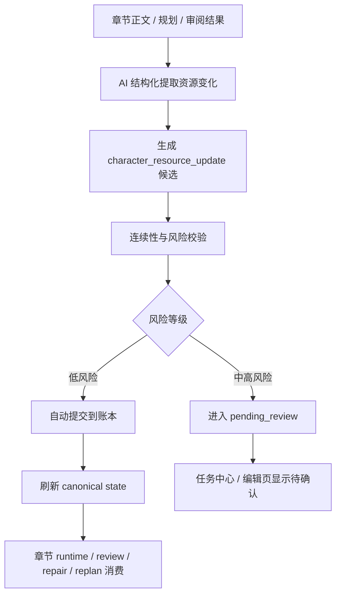

# 角色资源账本与背包系统执行计划

## 1. 定位

角色背包系统不应被设计成独立的道具 CRUD、装备栏或设定百科。它在当前项目中的正确定位是：

> 角色资源账本，记录角色当前拥有什么、能使用什么、失去了什么、隐藏着什么，以及这些资源如何影响后续章节规划、写作、审阅、修复和重规划。

产品侧可以称为“角色携带物”“关键资源”或“角色背包”。工程侧建议统一命名为 `Character Resource Ledger`。

它的核心目标不是让用户维护更多资料，而是让系统在写下一章前知道：

- 这个角色现在能做什么；
- 这个角色不能突然做什么；
- 哪些物品或资源必须提前铺垫；
- 哪些关键物已经出现但长期未被使用；
- 哪些资源变化会影响后续剧情窗口。

## 2. 产品目标

### 2.1 面向新手用户的目标

目标用户仍然是完全不懂写作流程的小白用户，因此角色资源账本必须降低认知负担：

- 默认由 AI 从章节、规划和审阅结果中提取资源变化；
- 用户只处理高风险确认，不需要手动维护全部物品；
- UI 只显示和当前写作决策有关的资源；
- 系统主动提示连续性风险，而不是要求用户翻历史章节自查；
- 背包信息必须进入章节写作链，不能停留在角色页展示。

### 2.2 面向系统主链的目标

角色资源账本要接入当前 P0 主链：

```text
书级 framing
  -> 故事宏观规划 / 约束引擎
  -> 动态角色系统
  -> 卷战略 / 卷骨架 / 节奏板
  -> 章节细化 bundle
  -> 章节执行 / runtime
  -> state sync
  -> narrative audit / replan
```

新增能力必须服务“长篇叙事控制”，而不是增加一个孤立页面。

## 3. 范围边界

### 3.1 本系统负责

- 角色当前持有或可调用的关键资源；
- 资源的获得、转移、隐藏、消耗、损坏、丢失、恢复；
- 资源的读者可见性、角色知情状态和剧情风险；
- 章节写作前的可用资源提示；
- 审阅和修复阶段的资源连续性检查；
- 重规划阶段的资源缺口、误用和滞留风险；
- 主角、长期角色、临时角色的不同追踪粒度。

### 3.2 本系统不负责

- 游戏化装备数值、负重、稀有度和战斗属性体系；
- 所有日用品、衣物、普通消耗品的完整明细；
- 替代世界管理、势力资源库或知识库；
- 替代 payoff ledger 的伏笔回收账本；
- 要求用户在开书前先填完整背包。

## 4. 角色分层策略

不同角色不应维护同等复杂度的背包。推荐按叙事权重分层。

### 4.1 主角

主角必须有完整资源账本。

主角背包本质上是“行动能力边界”。系统需要知道主角是否拥有钥匙、证据、身份凭证、武器、资金、药物、联系方式、线索物、特殊能力凭证等。

主角资源会直接影响：

- 本章能否执行某个行动；
- 下章是否需要先铺垫资源；
- 审阅时是否出现“凭空拿出物品”；
- 修复时应该局部补铺垫还是改行动方案；
- replan 时是否需要调整章节窗口。

### 4.2 核心配角与长期角色

核心配角和长期角色需要轻量资源账本。

不追踪所有日常物品，只追踪会影响剧情的资源：

- 关键线索；
- 身份凭证；
- 秘密文件；
- 关系信物；
- 武器或工具；
- 权限和人脉；
- 与主角互相转交的物品；
- 会在后续卷中兑现的承诺物。

这类资源主要用于保证角色行动一致性、关系推进和章节 repair 边界。

### 4.3 反派与对手

反派和对手需要“隐藏资源账本”。

这类资源不一定在产品侧叫背包，更像“底牌 / 可用手段”：

- 可调动的人；
- 控制的地点；
- 掌握的证据；
- 未公开能力；
- 陷阱和布置；
- 对主角的误导资源；
- 尚未揭示的真相入口。

反派资源的关键是可见性控制。读者、主角和反派本人对同一资源的知情状态可能不同，因此不能只做简单“拥有 / 没有”。

### 4.4 临时角色

临时角色默认不建立长期背包。

临时角色只在章节上下文中记录“场景资源”：

- 当前场景中交出的文件；
- 一次性提供的线索；
- 借给主角的工具；
- 被偷走或被拿走的物品；
- 场景结束后仍可能影响后续的资源。

如果 AI 判断某个资源会跨章复用、影响冲突、绑定伏笔或被主角带走，则自动提升为正式资源账本项。

### 4.5 组织、地点和世界资源

部分资源不属于角色，而属于组织、地点或世界规则：

- 门派宝库；
- 公司资料库；
- 实验室样本；
- 城市禁区钥匙；
- 势力授权；
- 地点控制权；
- 世界规则中的代价资源。

首版不单独建设完整组织背包，但数据合同应预留 `ownerType`，允许资源归属为 `character | organization | location | world | unknown`。角色持有只是 `holder`，不一定等于归属。

## 5. 资源类型

建议首版支持以下资源类型：

- `physical_item`：实体物品，例如钥匙、刀、信件、药物；
- `clue`：线索物或证据，例如照片、录音、残页、样本；
- `credential`：身份、权限、通行证、令牌、授权；
- `ability_resource`：能力凭证、契约、次数、代价槽；
- `relationship_token`：关系信物、承诺物、交易物；
- `consumable`：金钱、弹药、药量、可消耗次数；
- `hidden_card`：底牌、陷阱、未公开手段；
- `world_resource`：地点、组织、世界规则相关资源。

资源分类由 AI 结构化判断；代码只负责枚举校验和后处理，不用关键词规则兜底。

## 6. 核心数据合同

### 6.1 资源账本项

建议新增共享类型 `CharacterResourceLedgerItem`：

```ts
type CharacterResourceOwnerType =
  | "character"
  | "organization"
  | "location"
  | "world"
  | "unknown";

type CharacterResourceStatus =
  | "available"
  | "hidden"
  | "borrowed"
  | "transferred"
  | "lost"
  | "consumed"
  | "damaged"
  | "destroyed"
  | "stale";

type CharacterResourceNarrativeFunction =
  | "tool"
  | "clue"
  | "weapon"
  | "proof"
  | "key"
  | "cost"
  | "promise"
  | "hidden_card"
  | "constraint";

interface CharacterResourceLedgerItem {
  id: string;
  novelId: string;
  resourceKey: string;
  name: string;
  summary: string;
  resourceType: string;
  narrativeFunction: CharacterResourceNarrativeFunction;
  ownerType: CharacterResourceOwnerType;
  ownerId?: string | null;
  ownerName?: string | null;
  holderCharacterId?: string | null;
  holderCharacterName?: string | null;
  status: CharacterResourceStatus;
  readerKnows: boolean;
  holderKnows: boolean;
  knownByCharacterIds: string[];
  introducedChapterId?: string | null;
  introducedChapterOrder?: number | null;
  lastTouchedChapterId?: string | null;
  lastTouchedChapterOrder?: number | null;
  expectedUseStartChapterOrder?: number | null;
  expectedUseEndChapterOrder?: number | null;
  constraints: string[];
  riskSignals: CharacterResourceRiskSignal[];
  sourceRefs: CharacterResourceSourceRef[];
  evidence: CharacterResourceEvidence[];
  confidence?: number | null;
  createdAt: string;
  updatedAt: string;
}
```

### 6.2 资源事件

账本项保存当前状态，资源事件保存变化历史：

```ts
type CharacterResourceEventType =
  | "introduced"
  | "acquired"
  | "revealed"
  | "used"
  | "transferred"
  | "lost"
  | "consumed"
  | "damaged"
  | "destroyed"
  | "recovered"
  | "stale_marked";

interface CharacterResourceEvent {
  id: string;
  novelId: string;
  resourceId: string;
  chapterId?: string | null;
  chapterOrder?: number | null;
  eventType: CharacterResourceEventType;
  actorCharacterId?: string | null;
  fromHolderCharacterId?: string | null;
  toHolderCharacterId?: string | null;
  summary: string;
  evidence: string[];
  confidence?: number | null;
  createdAt: string;
}
```

### 6.3 Canonical state 扩展

建议给 `CanonicalCharacterRuntimeState` 增加资源摘要：

```ts
interface CanonicalCharacterResourceSummary {
  resourceId: string;
  name: string;
  status: CharacterResourceStatus;
  narrativeFunction: CharacterResourceNarrativeFunction;
  summary: string;
  constraints: string[];
  riskLevel: "none" | "info" | "warn" | "high";
}
```

再在角色运行态里增加：

```ts
resources: CanonicalCharacterResourceSummary[];
```

章节 runtime 不读取全量账本，只读取本章相关资源摘要。

### 6.4 StateChangeProposal 扩展

建议新增状态变更类型：

```ts
"character_resource_update"
```

其 payload 使用结构化合同：

```ts
interface CharacterResourceUpdatePayload {
  resourceKey?: string;
  resourceId?: string;
  resourceName: string;
  updateType: CharacterResourceEventType;
  ownerType?: CharacterResourceOwnerType;
  ownerId?: string | null;
  holderCharacterId?: string | null;
  previousHolderCharacterId?: string | null;
  statusAfter: CharacterResourceStatus;
  visibilityAfter: {
    readerKnows: boolean;
    holderKnows: boolean;
    knownByCharacterIds: string[];
  };
  narrativeImpact: string;
  expectedFutureUse?: string | null;
}
```

低风险变更可自动提交，高风险变更进入 `pending_review`。

## 7. AI 更新机制

### 7.1 更新来源

资源变化来自四类输入：

- 章节正文完成后；
- 章节审阅和 audit 完成后；
- 章节修复完成后；
- 卷级规划、章节细化或 replan 明确引入关键资源时。

### 7.2 更新流程



### 7.3 AI 提取输出

新增 PromptAsset，建议命名：

```text
novel.character_resource.extract_updates@v1
```

输出结构：

```json
{
  "updates": [
    {
      "resourceName": "",
      "resourceType": "physical_item",
      "updateType": "acquired",
      "holderCharacterName": "",
      "ownerName": "",
      "statusAfter": "available",
      "visibilityAfter": {
        "readerKnows": true,
        "holderKnows": true,
        "knownByCharacterNames": []
      },
      "narrativeFunction": "clue",
      "narrativeImpact": "",
      "expectedFutureUse": "",
      "evidence": [],
      "confidence": 0.8,
      "riskLevel": "low",
      "riskReason": ""
    }
  ],
  "continuityRisks": [
    {
      "title": "",
      "summary": "",
      "severity": "medium",
      "blockingResourceNames": [],
      "suggestedAction": "confirm | repair | replan | ignore"
    }
  ]
}
```

### 7.4 禁止的实现方式

不要用关键词表实现产品核心判断，例如：

- 看到“拿起”就判定获得；
- 看到“丢了”就判定丢失；
- 看到“钥匙”就硬归类为通行资源。

这些可以作为证据定位或测试样例，但不能成为核心路由和状态判断。

## 8. 自动提交与确认策略

### 8.1 可自动提交

低风险变更可以自动提交：

- 主角获得普通工具；
- 资源从未出现变成已介绍；
- 物品被使用但未改变主线；
- 章节明确写出角色之间的普通转交；
- 线索被某角色知道；
- 临时场景物品未跨章复用。

### 8.2 需要确认

以下变更进入 `pending_review`：

- 关键物品被销毁；
- 主角失去核心行动资源；
- 反派底牌提前暴露；
- 资源归属和现有账本冲突；
- 资源使用会改变卷级规划；
- 资源和 payoff ledger 的兑现窗口冲突；
- 资源突然出现但没有铺垫；
- AI 信心低于阈值。

### 8.3 明确拒绝

以下候选应被拒绝或标记为脏状态：

- 证据不足；
- 只是比喻性表达；
- 幻觉出的角色或物品；
- 与章节正文事实冲突；
- 与已有已确认账本状态强冲突且无法解释。

## 9. UI 设计

### 9.1 角色页：资源概览

角色详情页新增“关键资源”区域。

主角默认展开，长期角色默认折叠摘要，临时角色默认不显示长期背包。

展示字段：

- 当前可用资源；
- 隐藏资源 / 底牌；
- 最近变化；
- 需要确认；
- 风险提示；
- 与下一章相关的资源。

用户操作：

- 确认资源变化；
- 标记资源不重要；
- 手动补一条关键资源；
- 查看资源历史；
- 跳转到来源章节。

UI 文案应从用户视角表达，例如：

- “这个角色当前可以使用这些关键资源”
- “这些资源可能影响下一章行动”
- “这些变化需要确认后再进入后续写作”

避免写成“资源账本已接入 canonical state”这类实现说明。

### 9.2 章节准备区：本章资源提示

章节执行前，在章节准备或执行面板中增加“本章关键资源”。

展示：

- 本章建议使用；
- 本章需要铺垫；
- 本章不要提前使用；
- 缺失但当前计划需要的资源；
- 与 payoff / 伏笔相关的资源。

这些提示不应成为大型配置表，而是用于降低新手风险：

- “写这一章前，系统建议先让主角拿到通行凭证”
- “这个证据还没有被主角发现，不能直接拿来推理”
- “这件物品已经损坏，当前章节不应继续正常使用”

### 9.3 审阅和修复区：连续性风险

审阅结果中新增资源连续性问题：

- 未获得却使用；
- 已消耗却复用；
- 已转交却仍由原角色持有；
- 读者未知却被当作已铺垫；
- 角色不知情却据此行动；
- 关键资源长时间未触碰。

修复建议优先给 `patch_first`：

- 局部补一句获得来源；
- 改掉不合理使用；
- 将资源使用后移；
- 改成另一角色提供资源；
- 触发 replan。

### 9.4 任务中心与 pending review

当资源变更需要确认时，任务中心展示：

- 哪个角色；
- 哪个资源；
- 系统认为发生了什么变化；
- 为什么需要确认；
- 确认后会影响哪些后续章节或规划。

操作：

- 确认进入账本；
- 拒绝；
- 改为低重要度；
- 请求 AI 重新判断；
- 跳转来源章节。

### 9.5 卷级工作台：资源承诺视图

卷级工作台不显示全部背包，只显示跨章资源承诺：

- 本卷必须出现的关键物；
- 本卷必须消耗或转移的资源；
- 当前卷资源缺口；
- 影响 payoff 的关键物；
- 后续卷需要保留的底牌。

这能避免“资源账本”只在角色页存在，而不参与长篇节奏控制。

## 10. 后端组件

### 10.1 新增服务

建议新增：

- `CharacterResourceLedgerService`
  - 读写资源账本；
  - 合并同名或同义资源；
  - 计算角色资源摘要；
  - 生成章节相关资源窗口。

- `CharacterResourceExtractionService`
  - 调用 PromptAsset；
  - 从章节正文、规划和审阅结果提取资源变化；
  - 生成 `StateChangeProposal`。

- `CharacterResourceValidationService`
  - 校验资源连续性；
  - 计算风险等级；
  - 决定自动提交、待确认或拒绝。

- `CharacterResourceContextBuilder`
  - 给 runtime、review、repair、replan 构造轻量上下文；
  - 避免把全量账本塞给模型。

### 10.2 数据表建议

首版建议新增：

- `CharacterResourceLedgerItem`
- `CharacterResourceEvent`

可选新增：

- `CharacterResourceReview`
  - 如果 pending review 需要单独 UI 状态；
  - 也可以先复用现有 `StateChangeProposal`。

### 10.3 API 建议

首批接口：

- `GET /api/novels/:id/character-resources`
- `GET /api/novels/:id/characters/:characterId/resources`
- `GET /api/novels/:id/chapters/:chapterId/resource-context`
- `POST /api/novels/:id/chapters/:chapterId/resources/extract`
- `POST /api/novels/:id/character-resources/:resourceId/events`
- `POST /api/novels/:id/character-resource-proposals/:proposalId/confirm`
- `POST /api/novels/:id/character-resource-proposals/:proposalId/reject`

接口返回应包含 UI 可直接消费的摘要，不要求前端拼复杂状态。

## 11. 与现有模块的关系

### 11.1 动态角色系统

角色资源账本是动态角色系统的执行期补强。

现有动态角色系统关注：

- 角色目标；
- 当前状态；
- 阵营轨迹；
- 关系阶段；
- 缺席风险；
- 卷内职责。

资源账本补上：

- 角色行动资源；
- 资源可见性；
- 物品连续性；
- 底牌和工具的后续使用窗口。

### 11.2 Canonical state

资源账本不是新的大真源。它应作为分域正式资产，由 `CanonicalStateService` 汇总为当前状态摘要。

原则：

- 资源账本保存长期事实；
- canonical state 保存当前生产需要的轻量视图；
- runtime / review / repair 只消费当前任务相关资源窗口；
- 所有长期变更通过 `StateChangeProposal -> StateCommitService` 进入正式状态。

### 11.3 Payoff ledger

payoff ledger 管“叙事承诺”，资源账本管“角色资源和行动边界”。

二者会交叉，但不要合并：

- 一把枪可以是资源账本项；
- 如果这把枪被提前铺垫且必须在第 10 章使用，它同时会关联 payoff ledger；
- payoff ledger 负责兑现窗口和风险；
- 资源账本负责持有状态、可见性和使用连续性。

### 11.4 Chapter runtime

写作前上下文应包含：

- 参与角色的当前关键资源；
- 本章计划需要的资源；
- 缺失资源；
- 不允许提前使用的资源；
- 高风险资源约束。

这部分应进入章节执行上下文，而不是让 writer 自己从长篇资料里推断。

### 11.5 Review / repair / replan

审阅：

- 发现资源连续性问题；
- 标记缺失铺垫；
- 标记资源可见性错误。

修复：

- 优先局部补铺垫；
- 修改不合理使用；
- 必要时触发 replan。

重规划：

- 调整资源出现窗口；
- 前移铺垫章节；
- 后移使用章节；
- 改变角色行动方案。

## 12. 分期实施计划

### Phase 0：设计和合同收口

目标：把系统边界、数据合同和主链接入点固定下来。

任务：

- 新增共享类型草案；
- 明确 Prisma 模型；
- 明确 PromptAsset 输入输出；
- 明确 `StateChangeProposal` 扩展；
- 明确 UI 入口和首版展示范围；
- 明确自动提交和 pending review 策略。

验收：

- 文档、类型草案和接口草案一致；
- 不与 payoff ledger、dynamic character 和 canonical state 职责冲突；
- 新手 UI 不要求用户手填全量背包。

### Phase 1：最小资源账本后端

目标：能保存、读取和汇总角色关键资源。

任务：

- 新增 `CharacterResourceLedgerItem` 和 `CharacterResourceEvent`；
- 新增 service 和 mapper；
- 新增角色资源列表 API；
- 在角色运行态摘要中加入资源摘要；
- 补最小服务端测试。

验收：

- 主角和长期角色能读取当前关键资源；
- 资源事件能追溯到章节；
- canonical state 能读到轻量资源摘要；
- 不影响现有章节写作链。

### Phase 2：AI 资源变化提取

目标：章节完成后能自动提取资源变化。

任务：

- 新增 `novel.character_resource.extract_updates@v1` PromptAsset；
- 接入章节完成后的后台同步；
- 生成 `character_resource_update` 候选；
- 实现低风险自动提交和高风险待确认；
- 对接 `StateCommitService`。

验收：

- 章节中明确获得、转交、消耗的关键资源能被提取；
- 幻觉资源不会直接进入账本；
- 高风险变更进入 pending review；
- 资源变化能刷新后续上下文。

### Phase 3：Runtime / review / repair 消费

目标：资源账本真正影响章节生产。

任务：

- runtime 上下文加入本章相关资源；
- review 增加资源连续性检查；
- repair 增加资源问题的 `patch_first` 修复建议；
- replan 能看到资源缺口和误用风险；
- 补 targeted regression tests。

验收：

- 角色不会轻易使用未获得资源；
- 已消耗资源不会被正常复用；
- 缺少关键资源时，系统建议先铺垫或改写行动；
- 修复默认局部补丁优先。

### Phase 4：UI 首版

目标：用户能看见并确认资源账本，不需要理解内部状态系统。

任务：

- 角色页新增“关键资源”区域；
- 章节准备区新增“本章关键资源”；
- 审阅结果显示资源连续性问题；
- 任务中心显示资源变更待确认；
- 卷级工作台显示跨章资源承诺摘要。

验收：

- 主角资源默认清晰可见；
- 长期角色只显示关键资源；
- 临时角色资源默认只在章节上下文展示；
- 用户能确认或拒绝高风险变更；
- UI 文案从用户视角解释功能和下一步。

### Phase 5：跨卷资源承诺与高级能力

目标：让资源账本参与长篇节奏控制。

任务：

- 资源使用窗口接入卷级工作台；
- 资源与 payoff ledger 建立可选关联；
- 增加资源滞留、误回收、提前暴露风险；
- 支持组织 / 地点资源的更完整归属；
- 支持旧项目资源回填。

验收：

- 系统能提醒“这个关键物已经铺垫但长期未用”；
- 系统能提醒“这个资源应在本卷保留，不要提前消耗”；
- replan 能根据资源状态调整章节窗口；
- 旧项目可通过 AI 抽样回填关键资源。

## 13. 测试计划

### 13.1 服务端测试

- 创建、更新、读取角色资源账本；
- 资源事件顺序和章节引用；
- 同名资源合并与冲突检测；
- 低风险自动提交；
- 高风险 pending review；
- canonical state 资源摘要；
- runtime 上下文资源裁剪；
- review 资源连续性问题；
- repair 局部修复建议；
- replan 资源缺口判断。

### 13.2 Prompt 回归

固定样例覆盖：

- 主角获得钥匙；
- 主角把证据交给配角；
- 反派暗中保留底牌；
- 物品被消耗；
- 物品只是比喻，不应入账；
- 临时角色提供线索后消失；
- 资源和 payoff 兑现窗口相关；
- 章节中出现疑似未铺垫资源。

### 13.3 前端验收

- 主角角色页显示完整关键资源；
- 长期角色显示轻量资源；
- 临时角色不默认进入长期背包；
- 章节执行前展示本章可用资源和缺口；
- 审阅问题能跳到相关资源；
- pending review 能确认、拒绝、跳来源章节；
- UI 文案不出现实现迁移类表述。

## 14. 风险与取舍

### 14.1 维护成本过高

风险：背包系统变成另一个需要用户手工维护的大表。

对策：

- 默认 AI 提取；
- 只显示关键资源；
- 临时资源不默认长期化；
- 高风险才打扰用户。

### 14.2 AI 幻觉资源

风险：模型提取不存在的资源并写入状态。

对策：

- 提取必须带证据；
- 低信心进入待确认；
- 和已有角色、章节、规划交叉校验；
- 高影响资源不自动提交。

### 14.3 上下文膨胀

风险：把全量背包塞进 writer，拖慢生成并干扰正文。

对策：

- runtime 只消费本章相关窗口；
- 按参与角色、章节目标、资源风险裁剪；
- 资源账本详情只给审阅、修复和 UI。

### 14.4 与 payoff ledger 重叠

风险：资源账本和伏笔账本都在追踪关键物。

对策：

- payoff ledger 管承诺和兑现；
- 资源账本管持有、可见性和使用状态；
- 用可选关联连接，不合并职责。

## 15. 推荐优先级

建议把本能力作为 `P0-B / P0-E1` 的子项推进：

- 它补强“动态角色系统进入执行期行为判断”；
- 它依赖 canonical state 和 StateCommitService；
- 它能提升章节 runtime、review、repair、replan 的一致性；
- 它能减少小白用户手动盯连续性的负担。

不建议在当前阶段把它升级成独立大模块或独立一级导航。首版更适合嵌入角色页、章节准备区、审阅区和任务中心。

## 16. 最小可交付定义

首个可交付版本只需做到：

- 主角和长期角色有关键资源账本；
- 章节完成后 AI 能提取资源变化；
- 低风险自动提交，高风险待确认；
- 章节写作前能看到本章相关资源；
- 审阅能识别至少三类资源连续性问题；
- 用户能在 UI 中确认或拒绝资源变化。

只要这条闭环跑通，角色背包系统就已经从“设定管理”变成“长篇叙事控制”的一部分。
