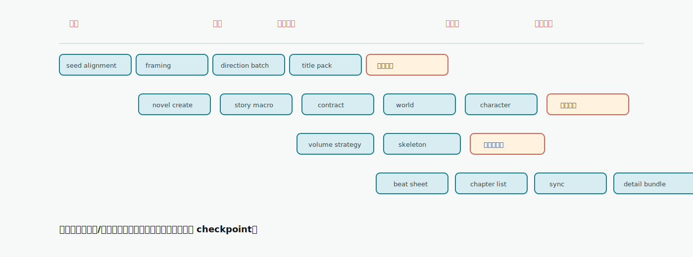

# 自动导演阶段全景

对应代码来源：

- `server/src/services/novel/director/projections/novelDirectorProgress.ts`
- `shared/types/directorWorkflowStepCatalogData.ts`
- `server/src/services/novel/director/novelDirectorPipelineRuntime.ts`
- `server/src/services/novel/director/commands/DirectorCommandService.ts`

<!-- DIRECTOR_PROGRESS_ITEM_KEYS: candidate_seed_alignment,candidate_project_framing,candidate_direction_batch,candidate_title_pack,novel_create,book_contract,story_macro,constraint_engine,world_setup,character_setup,character_cast_apply,volume_strategy,volume_skeleton,beat_sheet,chapter_list,chapter_sync,chapter_detail_bundle -->

自动导演不是一个五步向导，而是一条可暂停、可恢复、可自动审批的生产管线。用户看到“方向 → 世界 → 角色 → 拆章 → 执行”只是概览；任务中心和导演跟进里出现的 `volume_skeleton`、`beat_sheet`、`character_cast_apply` 等术语来自更细的阶段投影。

## 阶段分组

| 分组 | 阶段 | 目标 |
|---|---|---|
| 候选 | `candidate_seed_alignment` → `candidate_title_pack` | 从灵感生成可选书级方向和标题。 |
| 立项 | `novel_create` | 将确认的方向变成小说项目。 |
| 资产准备 | `story_macro` → `character_cast_apply` | 固化书契约、宏观故事、世界和角色。 |
| 卷规划 | `volume_strategy` → `volume_skeleton` | 生成卷级策略和骨架。 |
| 章节细化 | `beat_sheet` → `chapter_detail_bundle` | 生成节奏板、章节列表、章节任务单和执行资源。 |

## 分组详解

### 候选阶段

候选阶段解决“这本书到底写什么”。它不会直接写章节，而是把用户灵感整理成多个可选方向，避免新手一开始就被要求手动写世界观、角色和大纲。

| 阶段 | 用户会看到什么 | 产物去向 |
|---|---|---|
| `candidate_seed_alignment` | 系统理解输入灵感、题材、读者感受和默认参数 | 候选生成上下文 |
| `candidate_project_framing` | 系统形成书级定位、卖点和目标读者判断 | 候选 framing |
| `candidate_direction_batch` | 页面出现一批可选开书方向 | 候选方向列表 |
| `candidate_title_pack` | 选中方向出现标题组和推荐标题 | 候选标题包 |

这个阶段的核心 checkpoint 是 `candidate_selection_required`。用户可以选择方向、生成下一批、整批修订、单项修订或只重做标题。只有候选被确认后，系统才进入建书。

### 立项阶段

`novel_create` 把确认的候选方向变成真实小说项目。它会建立小说记录、导演任务状态、运行 snapshot 和后续 pipeline 所需的基础 payload。

这个阶段失败通常是运行时或持久化问题，不是创作判断问题。优先看任务中心错误，再重试 `confirm_candidate` 或恢复当前命令。

### 资产准备阶段

资产准备阶段把“我想写什么”变成“后续每章都能读取的资料”。

| 阶段 | 解决的问题 | 可查看/修订入口 |
|---|---|---|
| `story_macro` | 整本书长期冲突、推进循环、主线结构 | 小说规划、故事宏观 |
| `book_contract` | 目标读者、卖点、前 30 章承诺、硬约束 | 小说基础信息、书级默认写法 |
| `constraint_engine` | 把书契约转成后续阶段可用的约束摘要 | 导演跟进、运行状态 |
| `world_setup` | 本书世界规则、地点、势力、舞台边界 | 世界资产、小说资料 |
| `character_setup` | 生成角色候选和阵容草案 | 角色候选、导演跟进 |
| `character_cast_apply` | 把通过的角色阵容写入正式资产 | 角色页、角色关系 |

角色阶段是重要质量闸口。如果角色名仍像“导师型女主”“反派老板”这类功能位，或缺少身份锚点，系统应停在 `character_setup_required`，而不是把低质量阵容带进卷规划。

### 卷规划阶段

卷规划阶段解决“整本书怎么分卷推进”。它不直接写章节正文，而是先确定每卷读者承诺、主要冲突、阶段目标和结构承载。

| 阶段 | 产物 | 风险点 |
|---|---|---|
| `volume_strategy` | 分卷策略、卷级目标、推进路线 | 卷目标过散会导致后续章节缺主线。 |
| `volume_skeleton` | 卷列表、每卷任务、关键承诺 | 卷骨架错误会放大到节奏板和章节清单。 |

如果卷战略不对，优先在卷规划入口处理，不要只改章节标题。章节标题是下游结果，无法修正上游卷使命。

### 章节细化阶段

章节细化阶段把卷规划拆成可以执行的章节任务。它是自动导演和正文执行之间的移交层。

| 阶段 | 产物 | 进入下一步的条件 |
|---|---|---|
| `beat_sheet` | 节奏节点、章节跨度、冲突推进 | 节奏覆盖目标章节范围。 |
| `chapter_list` | 章节标题、顺序、基础目标 | 章节数量和卷目标一致。 |
| `chapter_sync` | 章节执行合同同步到章节记录 | 章节数据可被章节页读取。 |
| `chapter_detail_bundle` | 章节任务单、场景卡、目标和执行资源 | `chapter_batch_ready` checkpoint。 |

这个阶段属于高内存任务，重复启动同一本书同范围的拆章任务容易造成用户难以判断最终结果来自哪次运行。看到任务已排队或运行时，先去任务中心查看。

## 阶段总表

| 阶段 key | 中文名 | 输入 | 产物 | Checkpoint | Auto-approval | 失败后优先操作 |
|---|---|---|---|---|---|---|
| `candidate_seed_alignment` | 候选种子对齐 | 用户灵感、题材偏好、目标章节数、模型配置 | 候选生成输入 | 无 | 不涉及 | 修改灵感或模型后重新生成候选。 |
| `candidate_project_framing` | 项目立项框架 | 对齐后的 seed、用户目标 | 书级 framing、定位、卖点、目标读者 | 无 | 不涉及 | 在创作中枢补充目标或重新生成方向。 |
| `candidate_direction_batch` | 方向批次 | framing、候选生成提示、上一批反馈 | 候选方向批次 | `candidate_selection_required` | `candidate_direction_confirmed` 可授权确认后继续 | 生成下一批、修订全部候选或定向修正某一项。 |
| `candidate_title_pack` | 书名候选 | 已选候选、标题反馈 | 标题组、推荐标题 | `candidate_selection_required` | `candidate_direction_confirmed` | 只重做标题或确认候选进入建书。 |
| `novel_create` | 创建小说项目 | 已确认候选、运行模式、auto-approval 配置 | 小说项目、任务 seed、runtime snapshot | 无 | 确认候选后进入 | 如果创建失败，先看任务中心错误，通常可重试。 |
| `story_macro` | 故事宏观 | 候选方向、小说基础信息 | 故事宏观规划、冲突、长期推进 | 无 | 低风险自动继续 | 缺方向或模型失败时重试；结果不满意可回到故事宏观模块调整。 |
| `book_contract` | 书契约 | story macro、候选方向 | 目标读者、卖点、前 30 章承诺、硬约束 | `book_contract_ready` | 当前不绑定 auto-approval point | 可查看并修订书级默认写法和承诺。 |
| `constraint_engine` | 约束引擎 | 书契约、宏观故事、世界/角色边界 | 后续章节必须遵守的约束摘要 | 无 | 随规划链继续 | 如果约束过窄，先调整书契约或宏观故事。 |
| `world_setup` | 世界搭建 | 书契约、story macro、世界模式 | 本书世界骨架、规则、势力、地点 | 无 | 低风险自动继续 | 世界模式为 skip 时跳过；失败时从世界模块或导演跟进重试。 |
| `character_setup` | 角色生成 | 书契约、宏观故事、世界 | 角色候选、角色阵容草案 | `character_setup_required` | `character_setup_ready` 可授权通过后继续 | 审核角色候选、合并/确认角色，必要时重新生成角色阵容。 |
| `character_cast_apply` | 角色阵容应用 | 通过的角色候选 | 正式角色、角色关系、阵容状态 | `character_setup_required` 或通过后清除 | `character_setup_ready` | 角色质量不够时停在角色审核，不应继续卷规划。 |
| `volume_strategy` | 卷战略 | 书契约、宏观故事、角色阵容 | 分卷策略、推进路线、卷目标 | `volume_strategy_ready` | `volume_strategy_ready` | 修改卷战略或重新生成卷规划。 |
| `volume_skeleton` | 卷骨架 | 卷战略、角色和世界资产 | 卷列表、每卷任务、主承诺 | `volume_strategy_ready` | `volume_strategy_ready` | 卷数量或结构不合适时，从卷规划入口重做。 |
| `beat_sheet` | 节奏板 | 卷策略、卷骨架、章节范围 | 目标卷节奏节点、章节跨度 | 无 | 结构化拆章授权后继续 | 若跨度冲突，重生成节奏板，不要直接细化章节。 |
| `chapter_list` | 章节清单 | 节奏板、卷策略 | 章节标题、顺序、基础目标 | 无 | 结构化拆章授权后继续 | 清单不覆盖目标章数时，先修节奏板再重做清单。 |
| `chapter_sync` | 章节同步 | 章节清单、章节任务数据 | 章节执行合同同步到章节记录 | `chapter_batch_ready` | `structured_outline_ready` | 同步失败通常可重试；若章节数据错乱，回到章节清单核对。 |
| `chapter_detail_bundle` | 章节细化 | 章节清单、卷窗口、角色/世界资产 | 章节任务单、场景卡、目标、执行资源 | `chapter_batch_ready` | `structured_outline_ready` | 中断可从最近章节继续；重复失败时检查章节范围和高内存限流。 |

## 阶段产物在哪里看

| 产物 | 主要来源阶段 | 用户入口 | 说明 |
|---|---|---|---|
| 开书方向 | `candidate_direction_batch` | 方向选择页、创作中枢 | 用来决定是否建书。 |
| 标题组 | `candidate_title_pack` | 方向选择页 | 可以只重做标题，不必重做整批方向。 |
| 小说项目 | `novel_create` | 小说列表、小说工作区 | 进入后续资产准备的容器。 |
| 书契约 | `book_contract` | 小说基础信息、导演跟进 | 后续章节要遵守的读者承诺和边界。 |
| 故事宏观 | `story_macro` | 小说规划 | 定义长期冲突、推进循环和主要结构。 |
| 约束摘要 | `constraint_engine` | 导演跟进、运行状态 | 给后续 AI 调用提供硬边界。 |
| 世界资产 | `world_setup` | 世界资产、本书世界 | 影响场景、规则和势力关系。 |
| 角色阵容 | `character_setup` / `character_cast_apply` | 角色页、角色候选 | 通过后会成为正式角色资产。 |
| 卷战略 | `volume_strategy` | 卷规划 | 决定每卷目标和承诺。 |
| 卷骨架 | `volume_skeleton` | 卷规划 | 连接卷目标和章节拆分。 |
| 节奏板 | `beat_sheet` | 章节规划、导演跟进 | 定义目标范围内的节奏节点。 |
| 章节清单 | `chapter_list` | 章节列表 | 标题、顺序和基础章节目标。 |
| 章节任务单 | `chapter_detail_bundle` | 章节页、章节执行入口 | 正文生成的直接输入。 |

:::tip 产物应落到模块里
自动导演的结果不应该只停留在聊天记录或任务日志里。长期生效的信息必须落到小说资料、角色、世界、卷规划、章节任务、知识库或写法资产中。
:::

## Checkpoint 清单

| checkpoint | 中文含义 | 典型触发 | 用户动作 | auto-approval point |
|---|---|---|---|---|
| `candidate_selection_required` | 等待确认书级方向 | 候选方向或标题生成完成 | 选择方向、修订候选、重做标题 | `candidate_direction_confirmed` |
| `book_contract_ready` | 书级规划就绪 | 书契约生成完成 | 查看/调整书级承诺 | 无 |
| `character_setup_required` | 角色准备待确认 | 角色候选质量需要用户确认 | 确认、合并、重做角色阵容 | `character_setup_ready` |
| `volume_strategy_ready` | 卷战略就绪 | 卷战略和卷骨架完成 | 确认后进入节奏拆章 | `volume_strategy_ready` |
| `chapter_batch_ready` | 章节执行可继续 | 节奏板、章节清单、章节细化完成 | 进入章节执行或继续自动写章 | `structured_outline_ready` |
| `replan_required` | 需要处理质量修复 | 章节质量修复或重规划判断 | 查看修复原因，决定重规划或继续 | `replan_continue` / `low_risk_quality_repair_continue` |
| `workflow_completed` | 导演主流程完成 | 批次或全书执行结束 | 查看结果和后续任务 | 无 |
| `rewrite_snapshot_created` | 重写前备份已创建 | 重写/重新生成前 | 确认清理或取消 | `rewrite_cleanup_confirmed` |

:::checkpoint 人工确认与自动确认
auto-approval 不是“无条件跳过质量”。它只在配置允许的审批点生效，并且高风险点如重规划、重写清理默认应谨慎授权。
:::

## Auto-approval 行为分层

auto-approval 的价值是降低重复确认成本，但它不应该掩盖真正需要用户判断的创作风险。

| 风险层级 | 审批点 | 适合自动通过吗 | 原因 |
|---|---|---|---|
| 低风险规划继续 | `candidate_direction_confirmed`、`character_setup_ready`、`volume_strategy_ready`、`structured_outline_ready` | 可以按用户选择开启 | 用户已经确认主要方向，系统继续下一阶段。 |
| 中风险章节继续 | `chapter_execution_continue`、`low_risk_quality_repair_continue` | 适合小批量开启 | 会影响正文质量，但通常不改变整本结构。 |
| 高风险结构处理 | `replan_continue`、`rewrite_cleanup_confirmed` | 默认保留人工确认 | 可能改变后续结构、覆盖正文或清理旧产物。 |

新手用户更适合自动通过低风险规划点，让系统完成从开书到章节批次的连续准备；高风险点保留确认，避免不知道为什么结构被重做。

## 命令队列如何承载阶段

用户操作会进入 `DirectorRunCommand` 队列。常见命令包括：

| commandType | 作用 | 典型来源 |
|---|---|---|
| `generate_candidates` | 生成第一批候选方向 | 新手上路、创作中枢 |
| `refine_candidates` | 基于反馈修订候选批次 | 方向选择页 |
| `patch_candidate` | 定向修正某个候选 | 方向选择页 |
| `refine_titles` | 重做候选标题组 | 标题反馈 |
| `confirm_candidate` | 确认候选并创建小说 | 方向选择页 |
| `continue` | 从当前任务继续 | 导演跟进、任务中心 |
| `resume_from_checkpoint` | 从 checkpoint 恢复 | 导演跟进 |
| `retry` | 重试失败命令 | 任务中心 |
| `takeover` | 接管已有小说 | 小说工作区 |
| `approve_gate` | 批准当前 gate | 导演跟进 |
| `repair_chapter_titles` | 修复章节标题 | 章节标题修复 |

`DirectorWorker` 会租约命令、续租、执行、完成或失败。`ResourceGate` 会按小说和资源类型限制并发，例如 planner、writer、repair、state_resolution 默认每类 2 个槽位。节奏板、章节清单和章节细化还会走高内存保留，同一本书同范围通常只允许一个高内存任务。

## 阶段与命令的关系

阶段是用户理解进度的投影，命令是后台执行的单位。一个命令可能推进多个阶段，一个阶段也可能因为重试或恢复被多个命令触达。

| 用户动作 | 典型命令 | 可能推进的阶段 |
|---|---|---|
| 输入灵感生成方向 | `generate_candidates` | `candidate_seed_alignment`、`candidate_project_framing`、`candidate_direction_batch`、`candidate_title_pack` |
| 反馈候选方向 | `refine_candidates` / `patch_candidate` | `candidate_direction_batch`、`candidate_title_pack` |
| 只改标题 | `refine_titles` | `candidate_title_pack` |
| 确认候选建书 | `confirm_candidate` | `novel_create`、`story_macro`、`book_contract`、后续规划阶段 |
| 从暂停点继续 | `resume_from_checkpoint` | 当前 checkpoint 后续阶段 |
| 继续自动导演 | `continue` | 当前未完成阶段到下一 checkpoint |
| 重试失败任务 | `retry` | 失败命令负责的阶段 |
| 接管已有项目 | `takeover` | 从已存在资产推导可继续阶段 |
| 批准 gate | `approve_gate` | gate 后续阶段或章节执行 |

排查时不要只看阶段名，也要看任务中心里的命令类型和错误。阶段说明“卡在 beat_sheet”，命令错误可能实际来自模型、资源限流或持久化同步。

## 进度投影如何理解

导演跟进看到的进度不是后台日志原文，而是从运行状态投影出来的用户视图。

| 投影内容 | 说明 | 用户价值 |
|---|---|---|
| 当前阶段 | 当前最需要关注的 `DirectorProgressItemKey` | 知道卡在候选、角色、卷规划还是拆章。 |
| 已完成阶段 | 已有产物且可以作为后续输入的阶段 | 避免重复重跑已经完成的阶段。 |
| 当前 checkpoint | 是否等待确认、继续、修复或重规划 | 判断要去导演跟进还是任务中心。 |
| follow-up | 给用户的暂停提醒和下一步入口 | 防止用户不知道任务为什么停住。 |
| task status | 任务中心里的 queued/running/failed/stale | 判断后台是否还在运行。 |

如果投影显示阶段完成，但对应模块没有产物，优先检查同步阶段和任务中心错误；如果模块已有产物，但投影还停在旧阶段，优先检查任务状态是否 stale 或前端是否刷新到最新任务。

## 阶段事件与用户动作

| 阶段事件 | 用户动作 | 结果 |
|---|---|---|
| 候选批次生成完成 | 选方向、修订候选、生成下一批 | 继续候选阶段或进入建书。 |
| 标题组生成完成 | 选标题、重做标题、确认候选 | 进入 `novel_create`。 |
| 书契约就绪 | 查看读者承诺和前 30 章目标 | 继续世界和角色准备。 |
| 角色准备暂停 | 确认、合并、重做角色阵容 | 写入正式角色或回到角色生成。 |
| 卷战略就绪 | 确认卷目标和分卷路线 | 进入卷骨架和节奏拆章。 |
| 章节批次就绪 | 执行章节或授权自动写章 | 进入章节执行链。 |
| 低风险修复可继续 | 接受修复或记录质量债务 | 保留正文并继续后续章节。 |
| 重规划建议出现 | 查看原因并决定是否重规划 | 回到对应上游规划点。 |

这些事件应该让用户明确下一步，而不是只展示代码阶段名。公开文档和 UI 文案都应尽量给出“你可以做什么”。

## 失败重试原则

| 失败位置 | 推荐恢复 | 不推荐操作 |
|---|---|---|
| 候选生成失败 | 调整模型或输入后重试候选命令 | 删除小说数据。 |
| 角色阵容被驳回 | 在角色候选页确认/合并/重做 | 强行进入卷规划。 |
| 卷战略不满意 | 重做卷战略或调整书契约 | 直接改章节清单绕过卷目标。 |
| 节奏板跨度冲突 | 重新生成节奏板 | 只重跑章节细化。 |
| 章节细化中断 | 从任务中心恢复 stale 命令或从导演跟进继续 | 同范围重复启动多个高内存任务。 |
| `chapter_batch_ready` 后暂停 | 确认进入章节执行或开启 auto-approval | 把暂停视为失败。 |
| `replan_required` | 查看质量修复原因，再决定重规划或继续 | 把所有局部质量债务都升级成全局重规划。 |

## 按分组恢复

| 分组 | 常见卡点 | 推荐入口 | 判断标准 |
|---|---|---|---|
| 候选 | 没有满意方向、标题不合适、候选过散 | 方向选择页、创作中枢 | 先修订候选或标题，只有定位错了才重开。 |
| 立项 | 确认后没有生成小说 | 任务中心 | 看 `confirm_candidate` 是否 failed/stale。 |
| 资产准备 | 书契约、世界或角色质量不稳 | 导演跟进、对应资产页 | 能局部修正就局部修正，角色质量不过先停。 |
| 卷规划 | 卷目标不清、卷数不合适 | 卷规划、导演跟进 | 回到卷战略，不要只改下游章节标题。 |
| 章节细化 | 节奏板冲突、清单数量不对、同步失败 | 任务中心、章节规划 | 先恢复/重试高内存任务，再决定重做节奏板。 |
| 章节执行 | 审核没过、修复失败、质量债务 | 章节页、章节执行链 | 局部问题记债继续，结构问题再重规划。 |

:::warn 不要把局部问题升级成全局中断
章节审核中的局部质量债务、可修复 obligation gap 或低风险修复失败，不应自动阻断整本自动导演。只有明确 `replan_required`、正文不可用、运行时安全问题或数据完整性问题才应停止全局链。
:::

## 关联模块

| 模块 | 负责什么 | 与阶段的关系 |
|---|---|---|
| 创作中枢 | 用自然语言解释目标、发起任务、查看建议 | 可以触发候选、继续、恢复和章节执行，但不保存最终事实。 |
| 导演跟进 | 展示 checkpoint、暂停原因和下一步动作 | 是处理 waiting approval 的首选入口。 |
| 任务中心 | 展示后台命令、队列、错误、stale 和恢复 | 是排查 failed/running/queued 的首选入口。 |
| 小说基础信息 | 查看和修订书级信息、默认写法 | 承接 `book_contract` 和项目基础资料。 |
| 世界资产 | 查看本书世界、地点、势力和规则 | 承接 `world_setup`。 |
| 角色页 | 查看、确认和修订角色资产 | 承接 `character_setup` 和 `character_cast_apply`。 |
| 卷规划/章节页 | 查看卷战略、节奏板、章节清单和任务单 | 承接 `volume_*`、`beat_sheet`、`chapter_*`。 |

## 新增阶段时的文档检查

新增自动导演阶段时，不能只改后端类型。至少要同步检查：

| 检查项 | 需要更新什么 |
|---|---|
| 阶段 key | 本页顶部 `DIRECTOR_PROGRESS_ITEM_KEYS`。 |
| 阶段总表 | 中文名、输入、产物、checkpoint、auto-approval 和失败恢复。 |
| 分组详解 | 说明它属于候选、立项、资产准备、卷规划还是章节细化。 |
| 产物入口 | 如果有新产物，说明用户在哪里查看或修订。 |
| 恢复手册 | 如果新增失败模式，补到《按阶段恢复手册》。 |
| UI 文案 | 避免只显示新代码术语，让用户知道下一步动作。 |
| 校验脚本 | `pnpm check:docs-manifest` 应继续覆盖全部阶段。 |

新增 checkpoint 或 auto-approval point 时，还要同步更新《导演跟进》和任务中心相关说明。

阶段文档的目标是让用户能恢复任务，也让维护者知道新增阶段会影响哪些公开说明。
每次调整阶段投影后，都应同时确认用户入口、恢复入口和公开术语是否仍然一致。

## 常见误解

| 误解 | 正确认知 |
|---|---|
| “方向、世界、角色、拆章、执行”就是全部阶段 | 这是用户侧简化说法，真实投影至少覆盖 17 个 progress key。 |
| `chapter_batch_ready` 是一个阶段 | 它是 checkpoint，表示章节批次可以进入执行。 |
| `waiting approval` 是失败 | 多数情况下只是等待用户确认方向、角色、卷规划、章节批次或质量策略。 |
| auto-approval 会跳过所有审核 | 它只在配置允许的审批点继续，高风险点仍应保留确认。 |
| 任务中心显示 stale 就说明结果丢了 | stale 只表示 worker 租约过期，可能可以从命令或 checkpoint 恢复。 |
| 角色阶段可以跳过 | 角色质量会影响卷规划和章节执行，质量不过时应该停下确认。 |
| 节奏板失败时重跑章节细化就行 | 节奏板是章节清单和细化的上游，跨度冲突要先修节奏板。 |
| 局部质量债务必须重规划 | 可用正文加局部问题应记录债务并继续，除非明确要求 `replan_required`。 |

## 文档阅读建议

| 目标 | 推荐阅读 |
|---|---|
| 想知道一本书从灵感到可写会发生什么 | 《端到端生产链总览》 |
| 看到陌生阶段 key | 本页“阶段总表”和“UI 术语对照” |
| 不知道暂停该点哪里 | 《导演跟进》和《按阶段恢复手册》 |
| 后台任务 failed/stale | 《任务中心》 |
| 正文审核或修复卡住 | 《章节执行链》 |
| 知识库没命中 | 《知识与 RAG 召回链》 |

## UI 术语对照

| 代码术语 | 用户可理解表达 |
|---|---|
| `candidate_direction_batch` | 一批开书方向 |
| `candidate_title_pack` | 书名候选 |
| `character_cast_apply` | 角色阵容写入项目 |
| `volume_skeleton` | 卷级骨架 |
| `beat_sheet` | 卷内节奏板 |
| `chapter_sync` | 章节执行合同同步 |
| `chapter_detail_bundle` | 章节任务单细化 |
| `chapter_batch_ready` | 可以开始写这一批章节 |
| `replan_required` | 需要处理修复或重规划 |

## 维护规则

如果代码新增 `DirectorProgressItemKey`，本页顶部的 `DIRECTOR_PROGRESS_ITEM_KEYS` 清单必须同步。站点校验会读取代码和文档，发现阶段缺漏时阻止通过。
