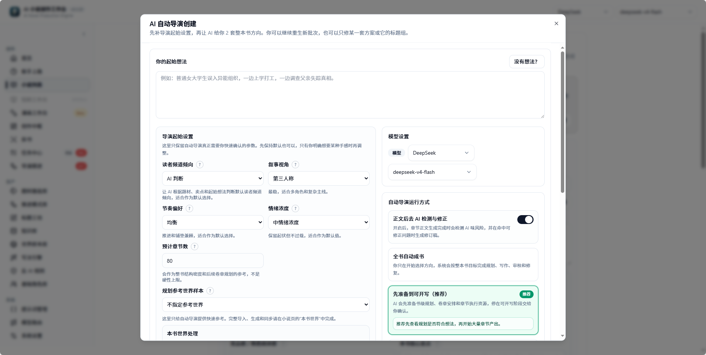
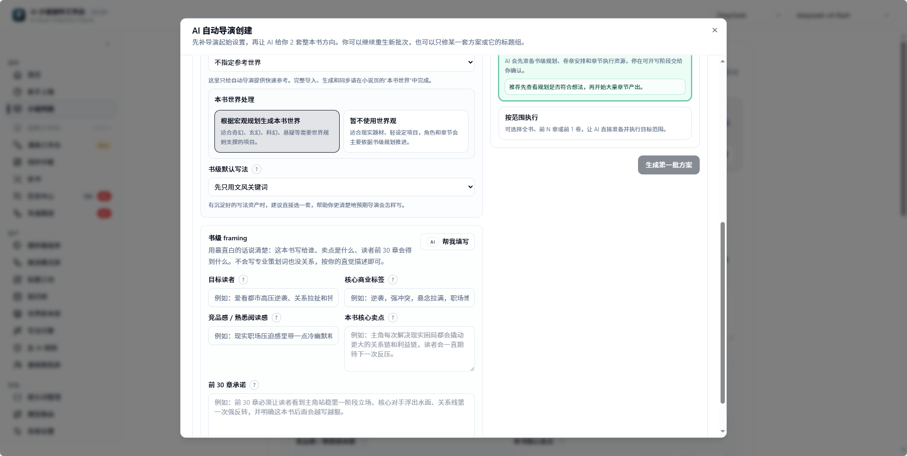
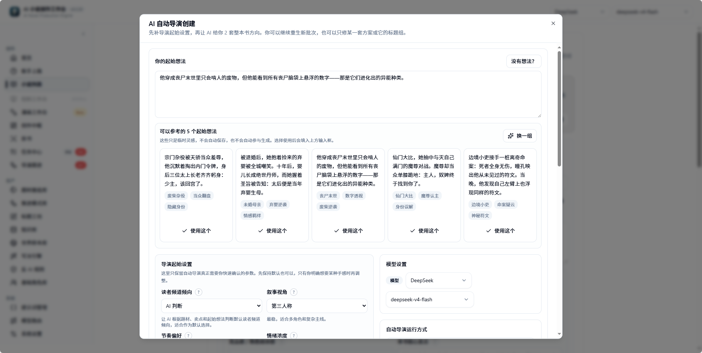
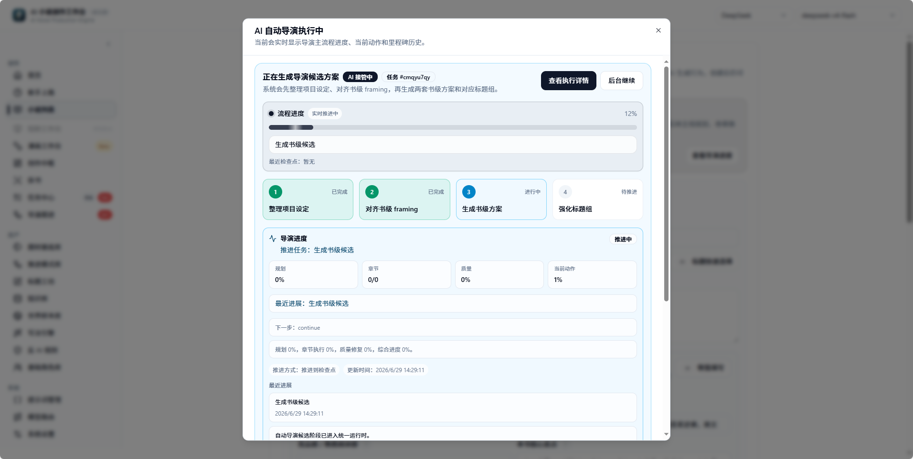
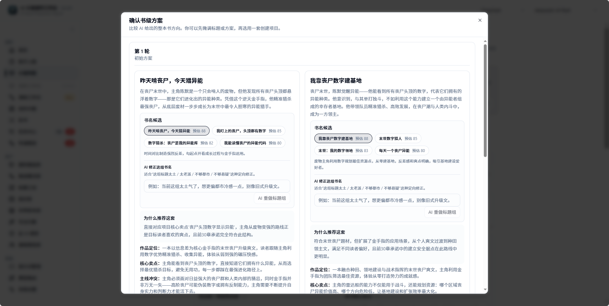
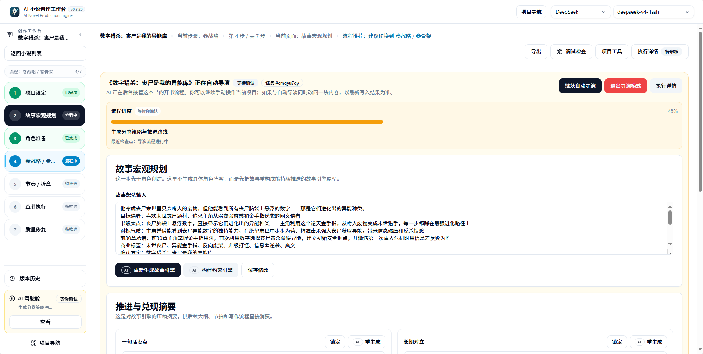
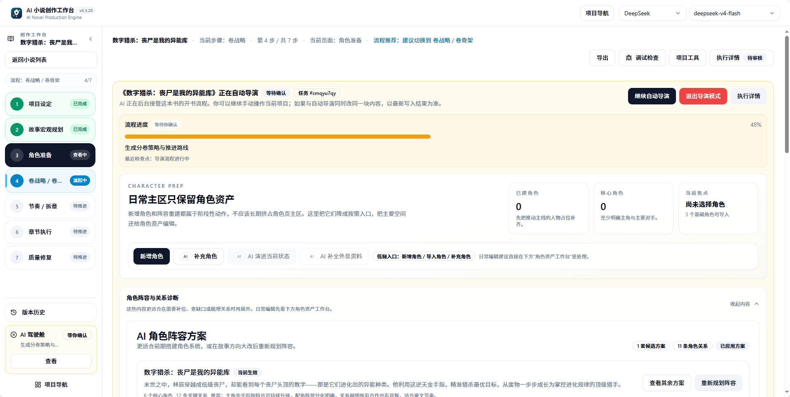
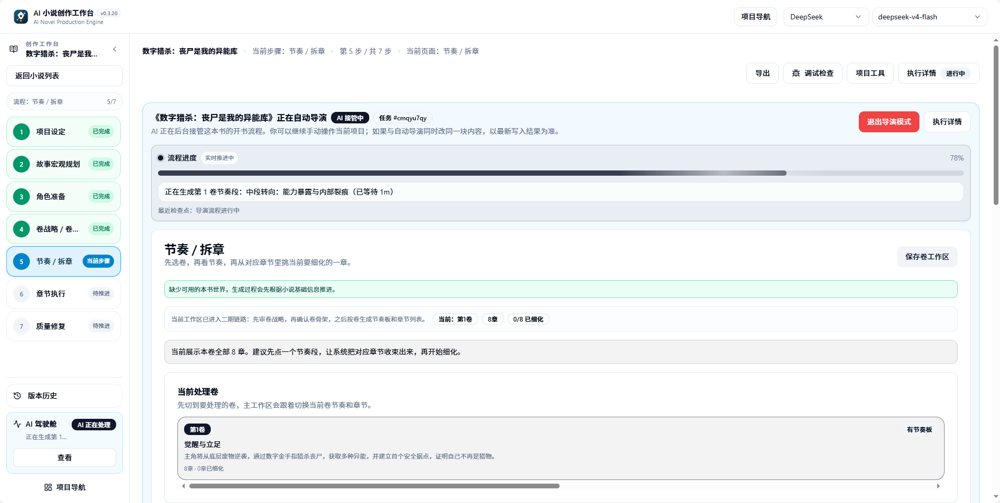

# 自动导演阶段全景

对应代码来源：

- `server/src/services/novel/director/projections/novelDirectorProgress.ts`
- `shared/types/directorWorkflowStepCatalogData.ts`
- `server/src/services/novel/director/novelDirectorPipelineRuntime.ts`
- `server/src/services/novel/director/commands/DirectorCommandService.ts`

<!-- DIRECTOR_PROGRESS_ITEM_KEYS: candidate_seed_alignment,candidate_project_framing,candidate_direction_batch,candidate_title_pack,novel_create,book_contract,story_macro,constraint_engine,world_setup,character_setup,character_cast_apply,volume_strategy,volume_skeleton,beat_sheet,chapter_list,chapter_sync,chapter_detail_bundle -->

自动导演不是一个五步向导，而是一条可暂停、可恢复、可自动审批的生产管线。用户看到“方向 → 世界 → 角色 → 拆章 → 执行”只是概览；任务中心和导演跟进里出现的 「卷骨架」、「节奏板」、「应用角色阵容」 等术语来自更细的阶段投影。

## 运行模式

启动自动导演时必须选择运行模式。模式决定管线**确认方案后自动跑到哪里**。模式不改变阶段顺序，只改变 auto-approval 边界、章节执行范围和哪些异常必须交还给用户。

| 模式 | 中文名 | 跑到哪里停 | 适合谁 | 风险 |
|---|---|---|---|---|
| 先准备到可开写（推荐） | 自动到就绪 | 确认方案后自动创建小说、生成书契约、角色、卷规划、节奏板和章节任务，停在可开写状态 | 第一次开书、想先看规划是否靠谱 | 不直接写正文，需要再确认进入章节执行 |
| 全书自动成书 | 全书自动驾驶 | 确认方案后持续推进规划、写作、审核和修复，直到完成目标章节或命中中断条件 | 想让系统从方案直接跑到小说产出 | 需要稳定模型、额度和较高容错 |
| 按范围执行 | 范围自动执行 | 只自动执行全书、前 N 章或第 1 卷等指定范围 | 想先验证一段，不想一次跑完整本 | 范围外章节不会自动写 |
| 正文后去 AI 检测与修正 | 质量修复开关 | 章节正文完成后进入 AI 味检测、审核和可修复问题处理 | 想要更完整的自动闭环 | 会增加耗时和模型消耗 |

### 全书自动驾驶的中断条件

「全书自动驾驶」遇到下列情形会**主动停下**等用户处理，而不是无限重试：

- 模型不可用 / 服务不可用 / 配额耗尽
- 质量审核要求重新规划
- 修复链路连续失败
- 检测到结构性数据问题或安全策略阻断

中断后状态会被保存到导演跟进，可以在排除问题后从原检查点恢复。

### 选择建议

- 第一本书想稳一点：选「先准备到可开写」，让 AI 自动完成规划、角色、卷和章节任务，再决定是否开始写正文。
- 第一本书想完整体验自动产出：选「全书自动成书」，并开启「正文后去 AI 检测与修正」。
- 想先试跑一小段：选「按范围执行」，先跑前 N 章或第 1 卷，确认正文质量后再扩大范围。
- 长时间无人值守前，先确认模型供应、额度、网络和任务中心都稳定。

模式可以在导演跟进的“继续自动导演”或接管动作里调整；切换不会丢失已完成的阶段产物。

## 从确认方案到小说产出的全自动链路

真实使用时，用户只需要做一个关键创作选择：**确认哪一套书级方案**。确认之后，系统会把后续步骤写入后台任务队列，由 AI 驾驶舱持续推进。

| 顺序 | 用户看到的界面 | 用户动作 | 系统自动做什么 | 结果 |
|---|---|---|---|---|
| 1 | AI 自动导演创建弹窗 | 输入起始想法；没有想法时点“没有想法?”选择灵感卡 | 整理灵感、读者偏好、叙事视角、节奏、情绪浓度和目标章节数 | 得到候选生成输入 |
| 2 | 自动导演运行方式 | 选择“先准备到可开写”或“全书自动成书”；按需开启“正文后去 AI 检测与修正” | 保存运行模式、范围、模型和 auto-approval 边界 | 决定后续是否自动写正文 |
| 3 | 生成第一批方案 | 点击“生成第一批方案” | 生成书级 framing、2 套完整方向和标题组 | 进入“确认书级方案”页 |
| 4 | 确认书级方案 | 比较方案、必要时重做标题组或修订某套方案，最后点击使用/确认方案 | 创建小说项目，写入候选方向、标题、书级目标和运行参数 | 进入小说工作区 |
| 5 | AI 驾驶舱 | 不需要逐阶段点确认；可以点“后台继续”或留在页面观察 | 自动生成故事宏观、书契约、约束、世界、角色、卷战略、卷骨架、节奏板、章节清单和章节细化 | 小说准备到可开写 |
| 6 | 章节执行 | 若选择“全书自动成书”或授权范围执行，用户无需再点下一章 | 按章节任务生成正文、审核、修复、记录质量债务并回灌状态 | 产出章节正文 |
| 7 | 质量闭环 | 只在高风险问题出现时处理提示 | 低风险问题自动修复或记录债务；结构性问题才暂停等待用户决定 | 后续章节继续读取新事实 |

### 界面截图路径

下面这组截图对应真实操作路径：创建自动导演任务、没有想法时选择灵感卡、生成第一批方案、确认书级方案，然后进入 AI 驾驶舱自动推进到角色、卷规划、节奏拆章和章节执行。

创建弹窗上半部分决定起始灵感、模型和运行方式。这里选择“先准备到可开写”或“全书自动成书”，会影响确认方案后是否自动进入正文产出。

创建弹窗下半部分用于设置世界处理、书级 framing、目标长度和生成动作。点击“生成第一批方案”后，系统进入候选阶段。

如果用户没有明确灵感，可以直接从灵感卡开始。灵感卡只负责给候选生成提供 seed，不要求用户先写完整大纲。

生成候选时，页面会显示当前任务进度。此时系统在后台完成灵感对齐、立项 framing、方向候选和书名候选。

确认书级方案是最后一个必须由用户做出的创作选择。确认后，系统创建小说，并把后续阶段写入自动导演任务链。

进入 AI 驾驶舱后，不需要逐个模块手动点击生成。顶部状态和左侧步骤显示当前自动导演的真实推进位置。

页面停在角色准备并不等于系统停住。只要 AI 驾驶舱显示正在处理或已进入后续步骤，后台会继续推进卷战略和拆章。

节奏板阶段会把卷规划拆成可执行章节任务。选择“全书自动成书”或授权范围执行后，系统会继续进入章节正文、审核和修复链路。

:::checkpoint 最后一个必须选择的创作点
“确认书级方案”是从创意选择进入自动生产的关键点。确认后，除非模型不可用、额度耗尽、结构性质量问题、重规划风险或用户主动退出导演模式，系统应自动推进到所选模式的目标结果。
:::

### 确认方案后会自动推进哪些页面

确认方案后，用户可能会看到页面停在某个模块，例如角色准备、卷战略或节奏/拆章。这不代表需要手动做完该模块。AI 驾驶舱顶部的状态条和左侧步骤才是自动导演事实状态：

| 页面现象 | 正确认知 |
|---|---|
| 页面停在“角色准备”，顶部显示正在生成卷战略 | 后台已经越过角色阶段，页面只是当前查看模块。 |
| 顶部显示“等待确认”，但有“继续自动导演” | 当前 checkpoint 需要授权继续，点击后会按已选模式续跑。 |
| 左侧 AI 驾驶舱显示“AI 正在处理” | 后台任务仍在执行，可以离开页面。 |
| 进度条显示节奏/拆章或章节执行 | 系统正在把规划转成章节任务或正文。 |
| 出现“退出导演模式” | 只有想改为手动工作流时才点；全自动链路中不要随意退出。 |

### 产出标准

选择“先准备到可开写”时，成功产出是：

- 小说项目已创建。
- 书契约、故事宏观、世界、角色、卷战略已保存。
- 第一批章节已有节奏板、章节清单和章节任务单。
- AI 驾驶舱停在可开写或章节批次就绪。

选择“全书自动成书”时，成功产出还包括：

- 目标范围内章节正文已生成。
- 每章有审核、修复记录或质量债务。
- 角色状态、事实、伏笔和世界变化回灌到后续章节。
- 全书或目标范围结束后，任务进入完成、可导出或可继续下一批状态。

## 阶段分组

| 分组 | 阶段 | 目标 |
|---|---|---|
| 候选 | 「灵感对齐」 → 「书名候选组」 | 从灵感生成可选书级方向和标题。 |
| 立项 | 「创建小说」 | 将确认的方向变成小说项目。 |
| 资产准备 | 「故事宏观」 → 「应用角色阵容」 | 固化书契约、宏观故事、世界和角色。 |
| 卷规划 | 「卷战略」 → 「卷骨架」 | 生成卷级策略和骨架。 |
| 章节细化 | 「节奏板」 → 「章节细化」 | 生成节奏板、章节列表、章节任务单和执行资源。 |

## 分组详解

### 候选阶段

候选阶段解决“这本书到底写什么”。它不会直接写章节，而是把用户灵感整理成多个可选方向，避免新手一开始就被要求手动写世界观、角色和大纲。

| 阶段 | 用户会看到什么 | 产物去向 |
|---|---|---|
| 「灵感对齐」 | 系统理解输入灵感、题材、读者感受和默认参数 | 候选生成上下文 |
| 「立项定位」 | 系统形成书级定位、卖点和目标读者判断 | 候选 framing |
| 「方向候选批次」 | 页面出现一批可选开书方向 | 候选方向列表 |
| 「书名候选组」 | 选中方向出现标题组和推荐标题 | 候选标题包 |

这个阶段的核心 checkpoint 是 「等待方向选择」。用户可以选择方向、生成下一批、整批修订、单项修订或只重做标题。只有候选被确认后，系统才进入建书。

### 立项阶段

「创建小说」 把确认的候选方向变成真实小说项目。它会建立小说记录、导演任务状态、运行 snapshot 和后续 pipeline 所需的基础 payload。

这个阶段失败通常是运行时或持久化问题，不是创作判断问题。优先看任务中心错误，再重试 「候选确认」 或恢复当前命令。

### 资产准备阶段

资产准备阶段把“我想写什么”变成“后续每章都能读取的资料”。

| 阶段 | 解决的问题 | 可查看/修订入口 |
|---|---|---|
| 「故事宏观」 | 整本书长期冲突、推进循环、主线结构 | 小说规划、故事宏观 |
| 「书契约」 | 目标读者、卖点、前 30 章承诺、硬约束 | 小说基础信息、书级默认写法 |
| 「写作约束」 | 把书契约转成后续阶段可用的约束摘要 | 导演跟进、运行状态 |
| 「世界搭建」 | 本书世界规则、地点、势力、舞台边界 | 世界资产、小说资料 |
| 「角色生成」 | 生成角色候选和阵容草案 | 角色候选、导演跟进 |
| 「应用角色阵容」 | 把通过的角色阵容写入正式资产 | 角色页、角色关系 |

角色阶段是重要质量闸口。如果角色名仍像“导师型女主”“反派老板”这类功能位，或缺少身份锚点，系统应停在 「等待角色确认」，而不是把低质量阵容带进卷规划。

### 卷规划阶段

卷规划阶段解决“整本书怎么分卷推进”。它不直接写章节正文，而是先确定每卷读者承诺、主要冲突、阶段目标和结构承载。

| 阶段 | 产物 | 风险点 |
|---|---|---|
| 「卷战略」 | 分卷策略、卷级目标、推进路线 | 卷目标过散会导致后续章节缺主线。 |
| 「卷骨架」 | 卷列表、每卷任务、关键承诺 | 卷骨架错误会放大到节奏板和章节清单。 |

如果卷战略不对，优先在卷规划入口处理，不要只改章节标题。章节标题是下游结果，无法修正上游卷使命。

### 章节细化阶段

章节细化阶段把卷规划拆成可以执行的章节任务。它是自动导演和正文执行之间的移交层。

| 阶段 | 产物 | 进入下一步的条件 |
|---|---|---|
| 「节奏板」 | 节奏节点、章节跨度、冲突推进 | 节奏覆盖目标章节范围。 |
| 「章节清单」 | 章节标题、顺序、基础目标 | 章节数量和卷目标一致。 |
| 「章节同步」 | 章节执行合同同步到章节记录 | 章节数据可被章节页读取。 |
| 「章节细化」 | 章节任务单、场景卡、目标和执行资源 | 「章节批次就绪」 checkpoint。 |

这个阶段属于高内存任务，重复启动同一本书同范围的拆章任务容易造成用户难以判断最终结果来自哪次运行。看到任务已排队或运行时，先去任务中心查看。

## 阶段总表

| 阶段 key | 中文名 | 输入 | 产物 | Checkpoint | Auto-approval | 失败后优先操作 |
|---|---|---|---|---|---|---|
| 「灵感对齐」 | 候选种子对齐 | 用户灵感、题材偏好、目标章节数、模型配置 | 候选生成输入 | 无 | 不涉及 | 修改灵感或模型后重新生成候选。 |
| 「立项定位」 | 项目立项框架 | 对齐后的 seed、用户目标 | 书级 framing、定位、卖点、目标读者 | 无 | 不涉及 | 在创作中枢补充目标或重新生成方向。 |
| 「方向候选批次」 | 方向批次 | framing、候选生成提示、上一批反馈 | 候选方向批次 | 「等待方向选择」 | 「方向已确认」 可授权确认后继续 | 生成下一批、修订全部候选或定向修正某一项。 |
| 「书名候选组」 | 书名候选 | 已选候选、标题反馈 | 标题组、推荐标题 | 「等待方向选择」 | 「方向已确认」 | 只重做标题或确认候选进入建书。 |
| 「创建小说」 | 创建小说项目 | 已确认候选、运行模式、auto-approval 配置 | 小说项目、任务 seed、runtime snapshot | 无 | 确认候选后进入 | 如果创建失败，先看任务中心错误，通常可重试。 |
| 「故事宏观」 | 故事宏观 | 候选方向、小说基础信息 | 故事宏观规划、冲突、长期推进 | 无 | 低风险自动继续 | 缺方向或模型失败时重试；结果不满意可回到故事宏观模块调整。 |
| 「书契约」 | 书契约 | story macro、候选方向 | 目标读者、卖点、前 30 章承诺、硬约束 | 「书契约就绪」 | 当前不绑定 auto-approval point | 可查看并修订书级默认写法和承诺。 |
| 「写作约束」 | 约束引擎 | 书契约、宏观故事、世界/角色边界 | 后续章节必须遵守的约束摘要 | 无 | 随规划链继续 | 如果约束过窄，先调整书契约或宏观故事。 |
| 「世界搭建」 | 世界搭建 | 书契约、story macro、世界模式 | 本书世界骨架、规则、势力、地点 | 无 | 低风险自动继续 | 世界模式为 skip 时跳过；失败时从世界模块或导演跟进重试。 |
| 「角色生成」 | 角色生成 | 书契约、宏观故事、世界 | 角色候选、角色阵容草案 | 「等待角色确认」 | 「角色就绪」 可授权通过后继续 | 审核角色候选、合并/确认角色，必要时重新生成角色阵容。 |
| 「应用角色阵容」 | 角色阵容应用 | 通过的角色候选 | 正式角色、角色关系、阵容状态 | 「等待角色确认」 或通过后清除 | 「角色就绪」 | 角色质量不够时停在角色审核，不应继续卷规划。 |
| 「卷战略」 | 卷战略 | 书契约、宏观故事、角色阵容 | 分卷策略、推进路线、卷目标 | 「卷战略就绪」 | 「卷战略就绪」 | 修改卷战略或重新生成卷规划。 |
| 「卷骨架」 | 卷骨架 | 卷战略、角色和世界资产 | 卷列表、每卷任务、主承诺 | 「卷战略就绪」 | 「卷战略就绪」 | 卷数量或结构不合适时，从卷规划入口重做。 |
| 「节奏板」 | 节奏板 | 卷策略、卷骨架、章节范围 | 目标卷节奏节点、章节跨度 | 无 | 结构化拆章授权后继续 | 若跨度冲突，重生成节奏板，不要直接细化章节。 |
| 「章节清单」 | 章节清单 | 节奏板、卷策略 | 章节标题、顺序、基础目标 | 无 | 结构化拆章授权后继续 | 清单不覆盖目标章数时，先修节奏板再重做清单。 |
| 「章节同步」 | 章节同步 | 章节清单、章节任务数据 | 章节执行合同同步到章节记录 | 「章节批次就绪」 | 「结构化大纲就绪」 | 同步失败通常可重试；若章节数据错乱，回到章节清单核对。 |
| 「章节细化」 | 章节细化 | 章节清单、卷窗口、角色/世界资产 | 章节任务单、场景卡、目标、执行资源 | 「章节批次就绪」 | 「结构化大纲就绪」 | 中断可从最近章节继续；重复失败时检查章节范围和高内存限流。 |

## 阶段产物在哪里看

| 产物 | 主要来源阶段 | 用户入口 | 说明 |
|---|---|---|---|
| 开书方向 | 「方向候选批次」 | 方向选择页、创作中枢 | 用来决定是否建书。 |
| 标题组 | 「书名候选组」 | 方向选择页 | 可以只重做标题，不必重做整批方向。 |
| 小说项目 | 「创建小说」 | 小说列表、小说工作区 | 进入后续资产准备的容器。 |
| 书契约 | 「书契约」 | 小说基础信息、导演跟进 | 后续章节要遵守的读者承诺和边界。 |
| 故事宏观 | 「故事宏观」 | 小说规划 | 定义长期冲突、推进循环和主要结构。 |
| 约束摘要 | 「写作约束」 | 导演跟进、运行状态 | 给后续 AI 调用提供硬边界。 |
| 世界资产 | 「世界搭建」 | 世界资产、本书世界 | 影响场景、规则和势力关系。 |
| 角色阵容 | 「角色生成」 / 「应用角色阵容」 | 角色页、角色候选 | 通过后会成为正式角色资产。 |
| 卷战略 | 「卷战略」 | 卷规划 | 决定每卷目标和承诺。 |
| 卷骨架 | 「卷骨架」 | 卷规划 | 连接卷目标和章节拆分。 |
| 节奏板 | 「节奏板」 | 章节规划、导演跟进 | 定义目标范围内的节奏节点。 |
| 章节清单 | 「章节清单」 | 章节列表 | 标题、顺序和基础章节目标。 |
| 章节任务单 | 「章节细化」 | 章节页、章节执行入口 | 正文生成的直接输入。 |

:::tip 产物应落到模块里
自动导演的结果不应该只停留在聊天记录或任务日志里。长期生效的信息必须落到小说资料、角色、世界、卷规划、章节任务、知识库或写法资产中。
:::

## Checkpoint 清单

| checkpoint | 中文含义 | 典型触发 | 用户动作 | auto-approval point |
|---|---|---|---|---|
| 「等待方向选择」 | 等待确认书级方向 | 候选方向或标题生成完成 | 选择方向、修订候选、重做标题 | 「方向已确认」 |
| 「书契约就绪」 | 书级规划就绪 | 书契约生成完成 | 查看/调整书级承诺 | 无 |
| 「等待角色确认」 | 角色准备待确认 | 角色候选质量需要用户确认 | 确认、合并、重做角色阵容 | 「角色就绪」 |
| 「卷战略就绪」 | 卷战略就绪 | 卷战略和卷骨架完成 | 确认后进入节奏拆章 | 「卷战略就绪」 |
| 「章节批次就绪」 | 章节执行可继续 | 节奏板、章节清单、章节细化完成 | 进入章节执行或继续自动写章 | 「结构化大纲就绪」 |
| 「等待重新规划」 | 需要处理质量修复 | 章节质量修复或重规划判断 | 查看修复原因，决定重规划或继续 | 「重新规划后继续」 / 「低风险修复后继续」 |
| 「全流程完成」 | 导演主流程完成 | 批次或全书执行结束 | 查看结果和后续任务 | 无 |
| 「重写快照已建立」 | 重写前备份已创建 | 重写/重新生成前 | 确认清理或取消 | 「重写清理已确认」 |

:::checkpoint 人工确认与自动确认
auto-approval 不是“无条件跳过质量”。它只在配置允许的审批点生效，并且高风险点如重规划、重写清理默认应谨慎授权。
:::

## Auto-approval 行为分层

auto-approval 的价值是降低重复确认成本，但它不应该掩盖真正需要用户判断的创作风险。

| 风险层级 | 审批点 | 适合自动通过吗 | 原因 |
|---|---|---|---|
| 低风险规划继续 | 「方向已确认」、「角色就绪」、「卷战略就绪」、「结构化大纲就绪」 | 可以按用户选择开启 | 用户已经确认主要方向，系统继续下一阶段。 |
| 中风险章节继续 | 「继续章节执行」、「低风险修复后继续」 | 适合小批量开启 | 会影响正文质量，但通常不改变整本结构。 |
| 高风险结构处理 | 「重新规划后继续」、「重写清理已确认」 | 默认保留人工确认 | 可能改变后续结构、覆盖正文或清理旧产物。 |

新手用户更适合自动通过低风险规划点，让系统完成从开书到章节批次的连续准备；高风险点保留确认，避免不知道为什么结构被重做。

## 命令队列如何承载阶段

用户操作会进入 `DirectorRunCommand` 队列。常见命令包括：

| commandType | 作用 | 典型来源 |
|---|---|---|
| 「生成候选」 | 生成第一批候选方向 | 新手上路、创作中枢 |
| 「修订候选」 | 基于反馈修订候选批次 | 方向选择页 |
| 「局部修订候选」 | 定向修正某个候选 | 方向选择页 |
| 「修订标题」 | 重做候选标题组 | 标题反馈 |
| 「候选确认」 | 确认候选并创建小说 | 方向选择页 |
| 「继续」 | 从当前任务继续 | 导演跟进、任务中心 |
| 「从检查点恢复」 | 从 checkpoint 恢复 | 导演跟进 |
| 「重试」 | 重试失败命令 | 任务中心 |
| 「接管」 | 接管已有小说 | 小说工作区 |
| 「审批关卡」 | 批准当前 gate | 导演跟进 |
| 「修复章节标题」 | 修复章节标题 | 章节标题修复 |

`DirectorWorker` 会租约命令、续租、执行、完成或失败。`ResourceGate` 会按小说和资源类型限制并发，例如 planner、writer、repair、state_resolution 默认每类 2 个槽位。节奏板、章节清单和章节细化还会走高内存保留，同一本书同范围通常只允许一个高内存任务。

## 阶段与命令的关系

阶段是用户理解进度的投影，命令是后台执行的单位。一个命令可能推进多个阶段，一个阶段也可能因为重试或恢复被多个命令触达。

| 用户动作 | 典型命令 | 可能推进的阶段 |
|---|---|---|
| 输入灵感生成方向 | 「生成候选」 | 「灵感对齐」、「立项定位」、「方向候选批次」、「书名候选组」 |
| 反馈候选方向 | 「修订候选」 / 「局部修订候选」 | 「方向候选批次」、「书名候选组」 |
| 只改标题 | 「修订标题」 | 「书名候选组」 |
| 确认候选建书 | 「候选确认」 | 「创建小说」、「故事宏观」、「书契约」、后续规划阶段 |
| 从暂停点继续 | 「从检查点恢复」 | 当前 checkpoint 后续阶段 |
| 继续自动导演 | 「继续」 | 当前未完成阶段到下一 checkpoint |
| 重试失败任务 | 「重试」 | 失败命令负责的阶段 |
| 接管已有项目 | 「接管」 | 从已存在资产推导可继续阶段 |
| 批准 gate | 「审批关卡」 | gate 后续阶段或章节执行 |

排查时不要只看阶段名，也要看任务中心里的命令类型和错误。阶段说明“卡在 beat_sheet”，命令错误可能实际来自模型、资源限流或持久化同步。

## 进度投影如何理解

导演跟进看到的进度不是后台日志原文，而是从运行状态投影出来的用户视图。

| 投影内容 | 说明 | 用户价值 |
|---|---|---|
| 当前阶段 | 当前最需要关注的 `DirectorProgressItemKey` | 知道卡在候选、角色、卷规划还是拆章。 |
| 已完成阶段 | 已有产物且可以作为后续输入的阶段 | 避免重复重跑已经完成的阶段。 |
| 当前 checkpoint | 是否等待确认、继续、修复或重规划 | 判断要去导演跟进还是任务中心。 |
| follow-up | 给用户的暂停提醒和下一步入口 | 防止用户不知道任务为什么停住。 |
| task status | 任务中心里的 queued/running/failed/stale | 判断后台是否还在运行。 |

如果投影显示阶段完成，但对应模块没有产物，优先检查同步阶段和任务中心错误；如果模块已有产物，但投影还停在旧阶段，优先检查任务状态是否 stale 或前端是否刷新到最新任务。

## 阶段事件与用户动作

| 阶段事件 | 用户动作 | 结果 |
|---|---|---|
| 候选批次生成完成 | 选方向、修订候选、生成下一批 | 继续候选阶段或进入建书。 |
| 标题组生成完成 | 选标题、重做标题、确认候选 | 进入 「创建小说」。 |
| 书契约就绪 | 查看读者承诺和前 30 章目标 | 继续世界和角色准备。 |
| 角色准备暂停 | 确认、合并、重做角色阵容 | 写入正式角色或回到角色生成。 |
| 卷战略就绪 | 确认卷目标和分卷路线 | 进入卷骨架和节奏拆章。 |
| 章节批次就绪 | 执行章节或授权自动写章 | 进入章节执行链。 |
| 低风险修复可继续 | 接受修复或记录质量债务 | 保留正文并继续后续章节。 |
| 重规划建议出现 | 查看原因并决定是否重规划 | 回到对应上游规划点。 |

这些事件应该让用户明确下一步，而不是只展示代码阶段名。公开文档和 UI 文案都应尽量给出“你可以做什么”。

## 失败重试原则

| 失败位置 | 推荐恢复 | 不推荐操作 |
|---|---|---|
| 候选生成失败 | 调整模型或输入后重试候选命令 | 删除小说数据。 |
| 角色阵容被驳回 | 在角色候选页确认/合并/重做 | 强行进入卷规划。 |
| 卷战略不满意 | 重做卷战略或调整书契约 | 直接改章节清单绕过卷目标。 |
| 节奏板跨度冲突 | 重新生成节奏板 | 只重跑章节细化。 |
| 章节细化中断 | 从任务中心恢复 stale 命令或从导演跟进继续 | 同范围重复启动多个高内存任务。 |
| 「章节批次就绪」 后暂停 | 确认进入章节执行或开启 auto-approval | 把暂停视为失败。 |
| 「等待重新规划」 | 查看质量修复原因，再决定重规划或继续 | 把所有局部质量债务都升级成全局重规划。 |

## 按分组恢复

| 分组 | 常见卡点 | 推荐入口 | 判断标准 |
|---|---|---|---|
| 候选 | 没有满意方向、标题不合适、候选过散 | 方向选择页、创作中枢 | 先修订候选或标题，只有定位错了才重开。 |
| 立项 | 确认后没有生成小说 | 任务中心 | 看 「候选确认」 是否 failed/stale。 |
| 资产准备 | 书契约、世界或角色质量不稳 | 导演跟进、对应资产页 | 能局部修正就局部修正，角色质量不过先停。 |
| 卷规划 | 卷目标不清、卷数不合适 | 卷规划、导演跟进 | 回到卷战略，不要只改下游章节标题。 |
| 章节细化 | 节奏板冲突、清单数量不对、同步失败 | 任务中心、章节规划 | 先恢复/重试高内存任务，再决定重做节奏板。 |
| 章节执行 | 审核没过、修复失败、质量债务 | 章节页、章节执行链 | 局部问题记债继续，结构问题再重规划。 |

:::warn 不要把局部问题升级成全局中断
章节审核中的局部质量债务、可修复 obligation gap 或低风险修复失败，不应自动阻断整本自动导演。只有明确 「等待重新规划」、正文不可用、运行时安全问题或数据完整性问题才应停止全局链。
:::

## 关联模块

| 模块 | 负责什么 | 与阶段的关系 |
|---|---|---|
| 创作中枢 | 用自然语言解释目标、发起任务、查看建议 | 可以触发候选、继续、恢复和章节执行，但不保存最终事实。 |
| 导演跟进 | 展示 checkpoint、暂停原因和下一步动作 | 是处理 waiting approval 的首选入口。 |
| 任务中心 | 展示后台命令、队列、错误、stale 和恢复 | 是排查 failed/running/queued 的首选入口。 |
| 小说基础信息 | 查看和修订书级信息、默认写法 | 承接 「书契约」 和项目基础资料。 |
| 世界资产 | 查看本书世界、地点、势力和规则 | 承接 「世界搭建」。 |
| 角色页 | 查看、确认和修订角色资产 | 承接 「角色生成」 和 「应用角色阵容」。 |
| 卷规划/章节页 | 查看卷战略、节奏板、章节清单和任务单 | 承接 `volume_*`、「节奏板」、`chapter_*`。 |

## 新增阶段时的文档检查

新增自动导演阶段时，不能只改后端类型。至少要同步检查：

| 检查项 | 需要更新什么 |
|---|---|
| 阶段 key | 本页顶部 `DIRECTOR_PROGRESS_ITEM_KEYS`。 |
| 阶段总表 | 中文名、输入、产物、checkpoint、auto-approval 和失败恢复。 |
| 分组详解 | 说明它属于候选、立项、资产准备、卷规划还是章节细化。 |
| 产物入口 | 如果有新产物，说明用户在哪里查看或修订。 |
| 恢复手册 | 如果新增失败模式，补到《按阶段恢复手册》。 |
| UI 文案 | 避免只显示新代码术语，让用户知道下一步动作。 |
| 校验脚本 | `pnpm check:docs-manifest` 应继续覆盖全部阶段。 |

新增 checkpoint 或 auto-approval point 时，还要同步更新《导演跟进》和任务中心相关说明。

阶段文档的目标是让用户能恢复任务，也让维护者知道新增阶段会影响哪些公开说明。
每次调整阶段投影后，都应同时确认用户入口、恢复入口和公开术语是否仍然一致。

## 常见误解

| 误解 | 正确认知 |
|---|---|
| “方向、世界、角色、拆章、执行”就是全部阶段 | 这是用户侧简化说法，真实投影至少覆盖 17 个 progress key。 |
| 「章节批次就绪」 是一个阶段 | 它是 checkpoint，表示章节批次可以进入执行。 |
| `waiting approval` 是失败 | 多数情况下只是等待用户确认方向、角色、卷规划、章节批次或质量策略。 |
| auto-approval 会跳过所有审核 | 它只在配置允许的审批点继续，高风险点仍应保留确认。 |
| 任务中心显示 stale 就说明结果丢了 | stale 只表示 worker 租约过期，可能可以从命令或 checkpoint 恢复。 |
| 角色阶段可以跳过 | 角色质量会影响卷规划和章节执行，质量不过时应该停下确认。 |
| 节奏板失败时重跑章节细化就行 | 节奏板是章节清单和细化的上游，跨度冲突要先修节奏板。 |
| 局部质量债务必须重规划 | 可用正文加局部问题应记录债务并继续，除非明确要求 「等待重新规划」。 |

## 文档阅读建议

| 目标 | 推荐阅读 |
|---|---|
| 想知道一本书从灵感到可写会发生什么 | 《端到端生产链总览》 |
| 看到陌生阶段 key | 本页“阶段总表”和“UI 术语对照” |
| 不知道暂停该点哪里 | 《导演跟进》和《按阶段恢复手册》 |
| 后台任务 failed/stale | 《任务中心》 |
| 正文审核或修复卡住 | 《章节执行链》 |
| 知识库没命中 | 《知识与 RAG 召回链》 |

## UI 术语对照

| 代码术语 | 用户可理解表达 |
|---|---|
| 「方向候选批次」 | 一批开书方向 |
| 「书名候选组」 | 书名候选 |
| 「应用角色阵容」 | 角色阵容写入项目 |
| 「卷骨架」 | 卷级骨架 |
| 「节奏板」 | 卷内节奏板 |
| 「章节同步」 | 章节执行合同同步 |
| 「章节细化」 | 章节任务单细化 |
| 「章节批次就绪」 | 可以开始写这一批章节 |
| 「等待重新规划」 | 需要处理修复或重规划 |

## 维护规则

如果代码新增 `DirectorProgressItemKey`，本页顶部的 `DIRECTOR_PROGRESS_ITEM_KEYS` 清单必须同步。站点校验会读取代码和文档，发现阶段缺漏时阻止通过。

## 技术别名对照表

文档面向用户，正文统一使用中文名。下表列出对应的内部 key，仅供开发者排查日志、调用接口或阅读源码时查阅。

| 中文名 | 内部 key |
|---|---|
| 灵感对齐 | `candidate_seed_alignment` |
| 立项定位 | `candidate_project_framing` |
| 方向候选批次 | `candidate_direction_batch` |
| 书名候选组 | `candidate_title_pack` |
| 等待方向选择 | `candidate_selection_required` |
| 方向已确认 | `candidate_direction_confirmed` |
| 候选确认 | `confirm_candidate` |
| 生成候选 | `generate_candidates` |
| 修订候选 | `refine_candidates` |
| 修订标题 | `refine_titles` |
| 局部修订候选 | `patch_candidate` |
| 创建小说 | `novel_create` |
| 书契约 / 书契约就绪 | `book_contract` / `book_contract_ready` |
| 故事宏观 | `story_macro` |
| 写作约束 | `constraint_engine` |
| 世界搭建 | `world_setup` |
| 角色生成 | `character_setup` |
| 等待角色确认 / 角色就绪 | `character_setup_required` / `character_setup_ready` |
| 应用角色阵容 | `character_cast_apply` |
| 角色资源同步 | `character_resource_sync` |
| 卷战略 / 卷战略就绪 | `volume_strategy` / `volume_strategy_ready` |
| 卷骨架 | `volume_skeleton` |
| 节奏板 | `beat_sheet` |
| 章节清单 | `chapter_list` |
| 章节同步 | `chapter_sync` |
| 章节细化 | `chapter_detail_bundle` |
| 章节批次就绪 | `chapter_batch_ready` |
| 结构化大纲就绪 | `structured_outline_ready` |
| 章节执行 / 继续章节执行 | `chapter_execution` / `chapter_execution_continue` |
| 章节质量审核 | `chapter_quality_review` |
| 章节修复 | `chapter_repair` |
| 章节状态回灌 | `chapter_state_commit` |
| 质量修复 / 低风险修复后继续 | `quality_repair` / `low_risk_quality_repair_continue` |
| 修复章节标题 | `repair_chapter_titles` |
| 重写快照已建立 / 重写清理已确认 | `rewrite_snapshot_created` / `rewrite_cleanup_confirmed` |
| 伏笔账本同步 | `payoff_ledger_sync` |
| 审批关卡 | `approve_gate` |
| 接管 | `takeover` |
| 从检查点恢复 | `resume_from_checkpoint` |
| 重试 / 继续 | `retry` / `continue` |
| 等待重新规划 / 重新规划后继续 | `replan_required` / `replan_continue` |
| 全流程完成 | `workflow_completed` |
