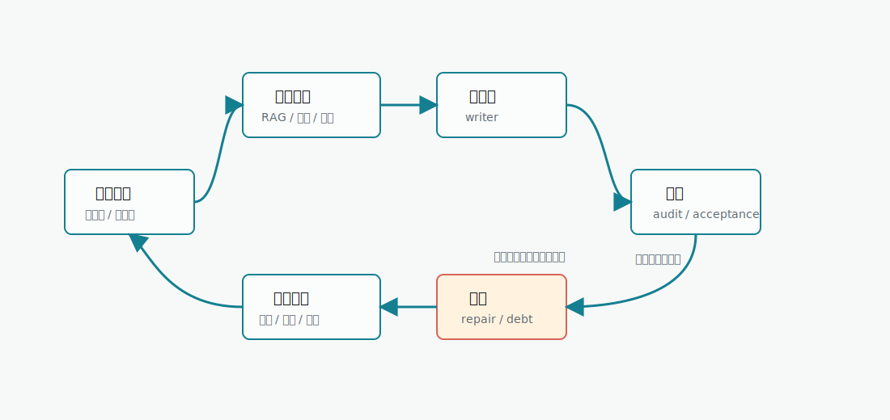

# 章节执行链

章节执行链负责把已经准备好的章节任务变成正文，并把正文产生的新状态回灌到后续章节。它不是“写一章”这么简单，而是正文生成、审核、修复、质量债务和状态同步组成的闭环。

## 执行入口

章节执行通常从两个入口进入：

| 入口 | 触发条件 | 说明 |
|---|---|---|
| 自动导演 `chapter_batch_ready` | 节奏板、章节清单、章节细化完成 | 用户确认或 auto-approval 后进入章节执行。 |
| 手动章节执行 | 用户在章节页或任务中心发起 | 适合单章重跑、测试模型或处理局部章节。 |

执行前必须有章节任务。任务来自 `chapter_detail_bundle`，通常包含章节目标、承接上一章、铺向下一章、场景卡、角色、冲突和禁忌。

## 章节任务单是什么

章节任务单是正文生成的合同，不是简单标题。它通常包含：

| 内容 | 作用 |
|---|---|
| 章节目标 | 说明本章必须推进什么。 |
| 承接上一章 | 防止开头脱离已有事实。 |
| 铺向下一章 | 让本章结尾服务后续节奏。 |
| 场景卡 | 指定地点、冲突、角色行动和场景顺序。 |
| 出场角色 | 限定本章人物、关系和可用资源。 |
| 必须兑现/铺垫 | 管理读者承诺和伏笔账本。 |
| 禁忌与硬约束 | 防止违背书契约、世界规则和角色状态。 |

如果任务单缺失或过于空泛，正文生成质量通常不会稳定。此时优先回到章节细化，而不是在正文输入框里临时补一句“写得更好”。

## 执行步骤

| 步骤 | 代码阶段 | 输入 | 产物 | 失败后如何处理 |
|---|---|---|---|---|
| 上下文组装 | `GenerationContextAssembler` | 章节任务、书契约、角色、世界、RAG、写法、事实账本 | `GenerationContextPackage` | 缺关键资产时回到导演跟进或小说页补资料。 |
| 正文生成 | `chapter_execution` / writer | 上下文包、模型路由、章节目标 | 正文草稿 | 空正文会重试一次；连续失败看模型和任务输入。 |
| 审核 | `chapter_quality_review` | 草稿、章节任务、上下文包 | audit report、open issues、acceptance status | 接收判断不可用时可记录质量债务。 |
| 修复 | `chapter_repair` / `quality_repair` | 草稿、审核问题、修复上下文 | 修复后正文、修复记录 | 低风险问题可自动修复；重规划风险进入 checkpoint。 |
| 状态提交 | `chapter_state_commit` | 最终正文、审核结果 | 连续性状态、角色状态 | 提交失败需重试状态同步，不一定重写正文。 |
| 伏笔同步 | `payoff_ledger_sync` | 正文、审核、读者承诺 | 伏笔、承诺、兑现状态 | 失败后可重试同步。 |
| 角色资源同步 | `character_resource_sync` | 正文、角色治理状态 | 角色资源、物品、关系变化 | 高风险资源会等待确认。 |

## 上下文包里有什么

章节写作上下文会聚合多个来源：

- 书契约：题材、目标读者、卖点、前 30 章承诺、硬约束。
- 宏观故事：核心冲突、推进循环、长期结构。
- 卷窗口：当前卷使命、章节位置、节奏指令。
- 角色状态：当前目标、位置、关系、能力、可用性。
- 世界切片：本章相关世界规则、地点和势力边界。
- 事实账本：已发生不可逆事实。
- 伏笔账本：本章应铺垫、轻触、加压或禁止揭露的承诺。
- 写法资产：绑定写法档案、风格规则、反 AI 规则。
- RAG 召回：与本章任务相关的知识库/拆书/资料片段。

:::tip 为什么章节不能只靠提示词
长篇小说的后续章节依赖已发生事实、角色资源、读者承诺和世界约束。章节执行链会把这些内容组装成上下文包，避免每章都只靠临时输入。
:::

## 生成前检查

发起章节执行前，系统和用户都应该关注这些条件：

| 检查项 | 为什么重要 | 异常时怎么处理 |
|---|---|---|
| 章节任务存在 | 没有任务单，正文目标不稳定 | 回到自动导演章节细化。 |
| 书契约存在 | 缺少读者承诺和硬约束 | 回到书契约或小说基础信息。 |
| 角色状态可读 | 角色行为需要边界 | 到角色页确认角色资产。 |
| 世界规则可读 | 场景和规则需要一致 | 到世界资产补齐关键规则。 |
| 模型路由可用 | 写作、审核、修复可能绑定不同模型 | 到模型路由或系统设置修正。 |
| 知识库索引完成 | 外部资料需要先被索引 | 到知识库查看索引状态。 |

这些检查不是要求用户手动填完所有资料，而是帮助定位失败原因。自动导演已经生成的资产，应优先由系统读取。

## 批量执行如何推进

章节批次通常不是一次只写一章。批量执行会在每章之间保存状态，并决定是否继续下一章。

| 批量节点 | 系统动作 | 用户可能看到 |
|---|---|---|
| 批次开始 | 读取 `chapter_batch_ready` 的章节范围 | 章节任务进入排队或运行。 |
| 单章生成 | 组装上下文、生成正文、审核修复 | 当前章节状态变化。 |
| 单章收尾 | 保存正文、回灌事实、角色、伏笔和质量信息 | 章节完成或带 warning 完成。 |
| 下一章准备 | 读取上一章回灌状态 | 下一章上下文更新。 |
| 批次暂停 | 遇到 checkpoint、失败或需要人工处理 | 导演跟进或任务中心出现入口。 |
| 批次完成 | 所有目标章节处理结束 | 可以继续下一批或查看质量债务。 |

如果 auto-approval 没有授权，批次可能在某些节点停下等待确认。这是为了让用户看见风险，而不是后台“没反应”。

## 审核与修复

审核会判断正文是否满足章节任务、连续性、人物行为、节奏和写法要求。修复不是无限循环，当前链路会限制重试次数并记录质量债务。

| 情况 | 推荐处理 |
|---|---|
| 轻微逻辑或节奏问题 | 允许轻修复或记录质量债务。 |
| 修复后可读但仍有局部问题 | 记录质量债务并继续后续章节。 |
| 正文不可用或空正文 | 重试生成，必要时换模型。 |
| 章节目标与大纲冲突 | 回到章节任务或节奏板重新规划。 |
| 修复要求会改变后续结构 | 进入 `replan_required`，由用户确认。 |

## 质量债务是什么

质量债务表示章节有可见问题，但不一定需要停止整本书。典型例子：

- 局部节奏不够强。
- 个别伏笔提示不足。
- 某段人物语气需要后续再修。
- 修复器无法稳定锚定某个段落。

质量债务应该被记录、展示和后续跟进，而不是默认阻断全局自动导演。只有明确重规划、不可恢复生成失败、数据风险或安全风险才应停止全局链。

## 质量判断分层

| 判断结果 | 含义 | 对全局链路的影响 |
|---|---|---|
| accepted | 正文满足当前任务 | 可以继续下一章。 |
| continue_with_warning | 有问题但正文可用 | 记录质量债务，继续后续章节。 |
| local_patch_plan | 可局部修复 | 尝试修复，修复后继续或记录债务。 |
| patchable_obligation_gap | 局部承诺缺口可补 | 低风险修复或记录债务。 |
| draft_obligation_unmet | 章节任务未满足 | 先尝试修复，必要时人工确认。 |
| defer_and_continue | 问题可后续处理 | 明确记录债务并继续。 |
| replan_required | 后续结构需要调整 | 进入 checkpoint，由用户确认。 |
| stop_for_replan | 必须停下重规划 | 停止全局链，回到规划入口。 |

:::checkpoint 局部质量债务不等于全局失败
只要章节有可用正文，且 AI/runtime 没有明确要求重规划，系统应优先保存正文、记录债务并允许后续章节继续。这样才能避免一本书因为单章小问题反复卡死。
:::

## 状态回灌

章节执行完成后，系统会回灌：

| 回灌对象 | 内容 | 影响 |
|---|---|---|
| 角色状态 | 位置、目标、关系、能力、资源变化 | 后续章节的角色行为边界。 |
| 事实账本 | 已发生事件、不可逆结果 | 防止后续重复或违背事实。 |
| 伏笔/承诺 | 新铺垫、兑现、延期、风险 | 帮助后续章节管理读者期待。 |
| 世界状态 | 地点、规则、势力变化 | 影响场景和冲突合理性。 |
| 审核问题 | open issues、质量债务 | 进入后续修复和任务提示。 |

## 回灌失败时怎么判断

| 现象 | 可能含义 | 推荐动作 |
|---|---|---|
| 正文已保存，但角色状态没更新 | 角色资源同步失败 | 重试角色资源同步，不重写正文。 |
| 伏笔账本未刷新 | payoff ledger 同步失败 | 重试账本同步，保留正文。 |
| 章节状态仍显示运行中 | 后台任务状态未收尾 | 看任务中心是否 stale 或 failed。 |
| 下一章上下文没带上上一章事实 | 状态提交未完成 | 先修复状态提交，再执行下一章。 |
| 审核报告缺失 | 审核服务失败或中断 | 可保留正文，后续重新审校。 |

章节正文生成和状态回灌是两个不同问题。正文已经可用时，优先修复回灌链路。

## 失败模式

| 失败模式 | 表现 | 先看哪里 | 推荐恢复 |
|---|---|---|---|
| 上下文组装失败 | 章节执行前报错 | 任务中心错误、小说资产 | 补角色/世界/章节任务后重试。 |
| 空正文 | 模型返回空内容 | 任务中心、模型路由 | 系统会重试一次；连续失败换模型。 |
| 审核不可用 | acceptance gate unavailable | 章节页、任务中心 | 保留正文，后续重新审校。 |
| 修复失败 | repair ticket 失败 | 任务中心、章节页 | 尝试重修；若已有可用正文，记录质量债务。 |
| 重规划风险 | `replan_required` | 导演跟进 | 人工确认重规划或接受风险继续。 |
| 状态同步失败 | 正文有了但状态未回灌 | 任务中心 | 重试同步，不优先重写正文。 |

## 重试、重写与继续

| 操作 | 适合情况 | 风险 |
|---|---|---|
| 重试生成 | 模型临时失败、空正文、网络中断 | 可能生成不同正文，需要重新审核。 |
| 重试审核 | 正文可用但审核失败 | 风险低，保留正文。 |
| 重试修复 | 局部问题可修 | 修复可能改变局部文本。 |
| 重试同步 | 正文可用但状态未回灌 | 风险低，优先使用。 |
| 接受质量债务继续 | 问题不阻断后续 | 后续需要可见跟踪。 |
| 重规划 | 章节目标和上游结构冲突 | 影响后续章节和规划产物。 |
| 重写章节 | 正文不可用或用户明确不接受 | 可能改变事实，需要重新回灌。 |

## 与 RAG 的关系

章节执行会在上下文组装时召回知识库、拆书、写法和本书资产。RAG 资料只是上下文的一部分，不应该覆盖章节任务单。

| 资料来源 | 在章节中的作用 |
|---|---|
| 知识库 | 提供事实资料、设定参考或用户上传资料。 |
| 拆书结果 | 提供节奏、人物、卖点和写法经验。 |
| 写法引擎 | 提供语言风格、表达规则和反 AI 约束。 |
| 世界样本 | 提供规则、地点、势力和氛围参考。 |
| 本书状态 | 提供不可违背的事实、角色和伏笔。 |

如果召回资料和本书状态冲突，本书状态优先。参考资料服务当前小说，不能把参考作品情节直接搬进正文。

## 人工介入入口

| 用户想做什么 | 推荐入口 | 原因 |
|---|---|---|
| 看正文是否保存 | 章节页 | 正文事实以章节页为准。 |
| 看后台为什么停 | 任务中心 | 失败、stale、queued、running 都在这里。 |
| 批准继续或重规划 | 导演跟进 | checkpoint 的下一步入口在这里。 |
| 调整章节目标 | 章节任务/章节规划 | 正文生成读取的是任务单。 |
| 修改角色状态 | 角色页 | 后续章节读取正式角色资产。 |
| 检查资料是否命中 | 知识库召回测试 | 判断 RAG 是否真的能命中。 |
| 调整写法 | 写法引擎 | 语言风格应从写法资产进入上下文。 |

不要把所有问题都丢给正文重写。正文重写适合正文不可用；任务、资产、召回和同步问题应该回到对应入口。

## 章节完成状态

| 状态 | 含义 | 后续动作 |
|---|---|---|
| 草稿已生成 | 模型产出正文，但还没完成审核闭环 | 等待审核或手动查看正文。 |
| 审核通过 | 正文满足章节任务 | 保存并进入状态回灌。 |
| 修复后通过 | 初稿有问题，修复后可用 | 保存修复正文和修复记录。 |
| 带质量债务完成 | 正文可用但有后续问题 | 继续后续章节，并保留债务。 |
| 等待重规划确认 | 审核认为下游结构可能受影响 | 到导演跟进确认。 |
| 同步失败 | 正文可能已保存，但状态未完全回灌 | 重试同步，不优先重写。 |
| 生成失败 | 没有可用正文 | 重试生成或换模型。 |

章节状态要区分“正文是否可用”和“链路是否收尾”。正文可用但同步失败时，直接重写可能制造新的事实分叉。

## 面向新手的判断

| 你看到的情况 | 先做什么 |
|---|---|
| 不知道这一章为什么这样写 | 看章节任务单和上下文摘要。 |
| 人物行为不对 | 看角色状态是否旧了，必要时回角色页修正。 |
| 世界规则不对 | 看世界资产是否缺失或冲突。 |
| 文风不对 | 看写法绑定和反 AI 规则。 |
| 写得像参考作品 | 看 RAG 召回和专名泄露审核。 |
| 系统提示需要重规划 | 先读原因，不要直接继续全部章节。 |

这些判断的目标是减少盲目重写，让用户优先修复真正出问题的环节。
对新手来说，先定位环节比反复点击“重新生成”更可靠。

## 和自动导演的关系

自动导演负责把章节批次准备好；章节执行链负责把这一批章节写出来并回灌状态。批次完成后，auto-approval 的 `chapter_execution_continue` 可以让系统继续处理剩余章节；没有授权时，系统会在 checkpoint 或任务中心等待用户确认。
