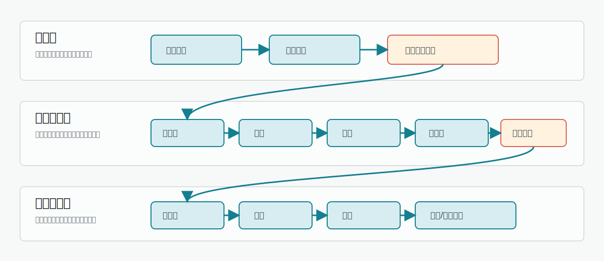

# 端到端生产链总览

这篇文档解释一本小说从一句灵感到章节批次就绪、再进入正文执行，会经过哪些层、哪些任务、哪些可恢复状态。它适合在第一次理解自动导演前阅读。

:::tip 推荐阅读顺序
先读本页建立全局地图，再读《自动导演阶段全景》《章节执行链》《知识与 RAG 召回链》。如果你只想照着操作，先看《第一本小说实操路径》。
:::

## 三层生产链

整条链路可以分成三层：

| 层级 | 目标 | 输入 | 主要产物 | 常见查看入口 |
|---|---|---|---|---|
| 灵感层 | 把模糊想法整理成可选择的书级方向 | 一句话灵感、题材偏好、读者感受、模型设置 | 候选方向、书名候选、开书定位 | 新手上路、创作中枢、自动导演方向选择 |
| 自动导演层 | 把书级方向转成可执行的小说资产 | 已确认候选、运行模式、auto-approval 配置 | 小说项目、书契约、宏观故事、世界、角色阵容、卷战略、节奏板、章节清单、章节任务单 | 导演跟进、小说页、任务中心 |
| 章节执行层 | 根据章节任务生成正文并回灌状态 | 章节任务、上下文包、知识库召回、写法资产、角色状态 | 正文草稿、审核报告、修复结果、质量债务、角色/事实/伏笔回灌 | 章节页、任务中心、导演跟进 |

## 三层边界

三层之间的边界要分清：

| 边界 | 可以做什么 | 不应该做什么 |
|---|---|---|
| 灵感层到自动导演层 | 通过候选确认创建小说项目 | 把聊天里的“我喜欢这个”当成已落库小说资产。 |
| 自动导演层到章节执行层 | 通过 `chapter_batch_ready` 移交章节任务 | 没有章节任务单就直接让模型写正文。 |
| 章节执行层到后续规划 | 通过状态回灌影响下一章和必要时重规划 | 每章都靠用户手动复述上一章事实。 |

如果某个信息需要长期影响后续章节，它必须跨过边界落到资产或任务记录里。只存在于对话上下文的内容，不能保证后续自动导演和章节执行稳定读取。

## 生产模式

自动导演入口通常有三种推进方式：

| 模式 | 适合用户 | 会停在哪里 |
|---|---|---|
| 按重要阶段审核 | 想确认方向、角色、卷规划的新手 | 候选、角色、卷战略、章节批次等 checkpoint。 |
| 自动推进到可开写 | 想尽快得到章节任务的用户 | 通常推进到 `chapter_batch_ready`。 |
| 继续自动执行前 10 章 | 想验证整条链是否能写出正文的用户 | 章节执行中遇到质量或重规划 checkpoint 时暂停。 |

新手如果不确定，优先选择按重要阶段审核。熟悉流程后，再开启低风险 auto-approval，让系统减少重复确认。

## 最短主链

用户看到的简化路径是：

1. 输入灵感。
2. 选择方向。
3. 准备世界和角色。
4. 拆成卷、节奏板和章节任务。
5. 执行章节。

代码里的真实链路更细。自动导演进度至少覆盖这些阶段：

| 阶段 key | 中文含义 | 属于哪层 | 主要作用 |
|---|---|---|---|
| `candidate_seed_alignment` | 候选种子对齐 | 灵感层 | 把用户灵感、题材偏好和默认参数整理成候选生成输入。 |
| `candidate_project_framing` | 项目立项框架 | 灵感层 | 生成书级 framing，明确定位、卖点、目标读者和承诺。 |
| `candidate_direction_batch` | 方向批次 | 灵感层 | 生成或修订多套可选开书方向。 |
| `candidate_title_pack` | 书名候选 | 灵感层 | 给选中的方向生成或修订标题组。 |
| `novel_create` | 创建小说 | 自动导演层 | 确认方向后创建小说项目和导演运行状态。 |
| `story_macro` | 故事宏观 | 自动导演层 | 生成整本故事输入、冲突、结构和长期推进策略。 |
| `book_contract` | 书契约 | 自动导演层 | 固化目标读者、卖点、前 30 章承诺、写作边界。 |
| `constraint_engine` | 约束引擎 | 自动导演层 | 把宏观约束、不可违背规则和推进边界写入上下文。 |
| `world_setup` | 世界搭建 | 自动导演层 | 创建或选择本书世界规则、舞台和势力边界。 |
| `character_setup` | 角色生成 | 自动导演层 | 生成核心角色和候选阵容。 |
| `character_cast_apply` | 角色阵容应用 | 自动导演层 | 将通过检查的角色阵容写入小说资产。 |
| `volume_strategy` | 卷战略 | 自动导演层 | 规划卷级目标、推进路线和读者承诺。 |
| `volume_skeleton` | 卷骨架 | 自动导演层 | 生成卷结构和每卷大致承载内容。 |
| `beat_sheet` | 节奏板 | 自动导演层 | 生成目标卷的节奏节点和章节跨度。 |
| `chapter_list` | 章节清单 | 自动导演层 | 将节奏板拆成章节列表。 |
| `chapter_sync` | 章节同步 | 自动导演层 | 把章节执行合同同步到章节数据。 |
| `chapter_detail_bundle` | 章节细化 | 自动导演层 | 生成章节任务单、场景卡、目标和执行资源。 |

`chapter_batch_ready` 不是 `DirectorProgressItemKey`，而是 checkpoint：表示目标章节范围已准备好，可以进入正文执行。

## 状态持久化点

自动导演不是只在内存里跑一串调用。关键状态会保存到数据库和任务记录里：

| 状态 | 保存内容 | 作用 |
|---|---|---|
| `directorRunCommand` | 命令类型、任务、租约、状态、payload、错误 | 支持排队、worker 执行、重试和 stale 恢复。 |
| `novelWorkflowTask` | 当前阶段、当前 item、checkpoint、进度、错误 | 让任务中心和导演跟进显示同一事实状态。 |
| Director runtime snapshot | 已完成步骤、产物、策略、事件 | 支持恢复、接管、运行时投影和 follow-up。 |
| 小说资产表 | 书契约、宏观故事、世界、角色、卷、章节任务 | 让后续章节和 UI 可以读取、修改、继续。 |
| 章节 runtime package | 写作上下文、审核结果、修复依据、质量信息 | 支持章节修复、质量债务和状态回灌。 |

## 持久化与恢复关系

| 恢复问题 | 依赖的持久化内容 | 说明 |
|---|---|---|
| 页面刷新后还能看到进度 | `novelWorkflowTask`、runtime snapshot | 前端不是进度事实源，只是读取后台状态。 |
| 服务重启后任务可继续 | `DirectorRunCommand` 租约和 stale 恢复 | 租约过期后由恢复逻辑判断自动回队列或等待手动恢复。 |
| 角色审核停住后可继续 | checkpoint payload、角色候选产物 | 用户确认后从 checkpoint 后续阶段继续。 |
| 章节正文已生成但同步失败 | 章节 runtime package、正文记录 | 优先重试同步，避免重写正文造成事实漂移。 |
| 质量修复后仍有小问题 | 质量债务记录 | 后续章节可继续，但问题需要可见和可追踪。 |

:::tip 前端状态不是最终事实
如果页面显示和任务中心不一致，优先相信任务中心和导演跟进里的后台任务状态。页面刷新、路由参数丢失或通知延迟，不代表后台任务已经停止。
:::

## 跨层移交

跨层移交不是单个按钮完成，而是通过产物和 checkpoint 衔接：

1. 候选方向确认后，`confirm_candidate` 命令创建小说。
2. 小说创建后，自动导演进入规划链。
3. 规划链把书契约、世界、角色、卷战略和章节任务逐步落库。
4. `chapter_batch_ready` checkpoint 表示章节任务可执行。
5. 用户确认或 auto-approval 授权后，章节执行链开始写正文。
6. 正文执行结束后，章节状态、角色资源、伏笔和质量债务回灌到后续上下文。

:::checkpoint checkpoint 的作用
checkpoint 是“可以暂停给用户确认”的边界，不是失败。它让用户在方向、角色、卷战略、章节批次或质量修复前决定继续、调整、重试或重新规划。
:::

## 任务如何排队运行

自动导演入口不会直接在页面请求里跑完整链路。请求会写入 `DirectorRunCommand`，由 `DirectorWorker` 租约执行：

| 机制 | 用户能感受到什么 | 代码来源 |
|---|---|---|
| 命令排队 | 发起后任务进入队列，页面可以离开 | `DirectorCommandService` |
| Worker 租约 | 后台 worker 领取命令并续租 | `DirectorTaskQueue` / `directorWorker` |
| ResourceGate | 同一本书同类资源有限流，避免并发互相覆盖 | `DirectorTaskQueue` |
| 高内存保留 | 节奏板、章节清单、章节细化等重任务会阻止同范围重复启动 | `autoDirectorMemorySafety.ts` |
| stale 恢复 | worker 中断后，部分命令自动回到队列，部分进入手动恢复 | `recoverStaleLeases` |

## 用户可修改点

| 生产位置 | 用户适合修改什么 | 修改后应从哪里继续 |
|---|---|---|
| 候选方向前 | 灵感、题材、目标读者、偏好 | 重新生成候选方向。 |
| 候选方向后 | 方向选择、标题、反馈 | 确认候选或修订候选。 |
| 书契约后 | 读者承诺、书级默认写法、硬约束 | 从导演跟进继续后续资产准备。 |
| 角色准备后 | 角色名、身份锚点、关系、阵容取舍 | 确认角色阵容后继续卷规划。 |
| 卷战略后 | 卷目标、卷数量、推进路线 | 重新生成卷骨架或继续拆章。 |
| 章节清单后 | 章节标题、章节数量、任务目标 | 同步/细化章节任务。 |
| 正文生成后 | 局部文本、质量债务、修复策略 | 重试修复、记录债务或继续下一章。 |

修改上游产物会影响下游。比如改书契约可能需要重跑卷规划；改角色阵容可能需要重跑节奏板；只改章节正文通常不需要重跑候选方向。

## 关键观测点

从空项目到章节批次完成，用户最应该观察这些节点：

| 观测点 | 表示什么 | 看到异常时 |
|---|---|---|
| 候选方向出现 | 灵感已经转成可选书级方案 | 回到方向选择页修订或生成下一批。 |
| 小说出现在列表中 | `novel_create` 已完成 | 如果后续没动，看任务中心是否继续运行。 |
| 书契约可查看 | 书级目标已经落库 | 不满意时先改书契约，再继续后续阶段。 |
| 角色候选暂停 | 系统认为角色需要确认 | 不要跳过，先确认身份锚点和阵容质量。 |
| 卷战略就绪 | 整本推进路线已形成 | 卷目标不准时先改卷战略。 |
| 章节列表出现 | 节奏板已转成章节清单 | 数量或顺序不对时回到节奏板。 |
| 章节任务单完成 | 章节执行已有输入 | 可以进入正文生成。 |
| 正文与回灌完成 | 章节闭环结束 | 下一章可以读取新事实和角色状态。 |

这些观测点比“进度条百分比”更重要。长链路的关键不是跑到 100%，而是每个移交点是否真的保存了可用产物。

## 资产闭环

端到端生产链的目标不是一次生成一章，而是让每章结果继续服务后续生产。

| 回灌资产 | 来源 | 后续用途 |
|---|---|---|
| 新事实 | 章节正文、状态提交 | 防止后续章节违背已发生事件。 |
| 角色变化 | 正文、角色资源同步 | 约束角色位置、能力、关系和可用资源。 |
| 世界变化 | 正文、世界状态同步 | 影响地点、势力和规则。 |
| 伏笔状态 | 审核、payoff ledger | 管理铺垫、兑现、延期和风险。 |
| 质量债务 | 审核、修复 | 给后续修订和重规划提供依据。 |

资产闭环也是 RAG 和写法资产的基础。知识库提供外部资料，章节执行产生本书内部事实，两者一起进入下一章上下文。

## 端到端职责分工

| 组件 | 负责 | 不负责 |
|---|---|---|
| 新手上路 | 帮用户从空白进入开书流程 | 解释每个内部运行细节。 |
| 创作中枢 | 用自然语言发起、解释和衔接任务 | 替代正式资产保存。 |
| 自动导演 | 准备书级、世界、角色、卷和章节任务 | 直接编辑已生成正文。 |
| 任务中心 | 说明后台命令状态和错误 | 判断创作方案好不好。 |
| 导演跟进 | 解释 checkpoint 和恢复入口 | 展示所有底层日志。 |
| 章节执行 | 写正文、审核、修复和回灌 | 重新决定整本书方向。 |
| 知识库/RAG | 提供资料召回和上下文补充 | 覆盖本书已发生事实。 |

理解职责分工可以减少误操作：后台失败看任务中心，等待确认看导演跟进，资产不对看对应模块，正文问题看章节执行。

## 典型移交示例

| 当前情况 | 已有产物 | 下一步 |
|---|---|---|
| 只有一句灵感 | 用户输入和模型配置 | 生成候选方向。 |
| 已选中方向和标题 | 候选方向、标题组 | 确认候选并创建小说。 |
| 小说已创建但无角色 | 书契约、故事宏观可能已生成 | 继续世界和角色准备。 |
| 角色已确认但无章节 | 角色阵容、卷战略可能已生成 | 进入卷骨架、节奏板和章节清单。 |
| 章节任务单已完成 | 章节目标、场景卡、上下文资源 | 进入章节执行。 |
| 正文已完成但有 warning | 正文、审核报告、质量债务 | 继续下一章并后续修订。 |
| 连续章节偏离主线 | 正文、质量问题、任务记录 | 回到卷规划或章节规划重做。 |

移交是否成功，关键看下游是否能读取上游产物。比如章节执行能读到章节任务单，才说明自动导演真的完成了章节准备。

如果下游读不到产物，优先排查同步和恢复，不要直接从最开始重跑整条链。
这能减少重复消耗，也能保留已经通过确认的书级和角色资产。

## 用户应该看哪里

| 你看到的问题 | 先看哪里 | 原因 |
|---|---|---|
| 自动导演停住 | 导演跟进 | 它显示 checkpoint、暂停原因和恢复入口。 |
| 后台任务没动 | 任务中心 | 它显示命令队列、任务状态、错误和 stale 恢复。 |
| 章节质量没过 | 章节执行链文档 + 任务中心 | 需要判断是修复、质量债务、重规划还是继续。 |
| 知识库没召回 | 知识与 RAG 召回链 | 需要确认索引、检索查询、资料来源和召回阶段。 |
| 角色/世界不对 | 小说页、角色库、世界资产 | 自动导演产物可在对应资产模块查看和修正。 |

## 什么时候重新规划

不是所有问题都应该重规划。下面是判断标准：

| 情况 | 推荐动作 |
|---|---|
| 候选方向不喜欢 | 生成下一批或修订候选。 |
| 角色名字或身份薄弱 | 停在角色审核，合并/重做角色。 |
| 卷目标不匹配书契约 | 重做卷战略或卷骨架。 |
| 单章节奏弱但正文可用 | 记录质量债务或轻修复。 |
| 连续多章违背书契约 | 触发重规划或回到卷/章节规划。 |
| 正文为空或不可用 | 重试生成或换模型，不直接重规划整本书。 |
| 状态同步失败 | 重试状态同步，不优先重写正文。 |

重规划适合处理结构性偏差，不适合替代局部修复。

## 相关深度文档

- 《自动导演阶段全景》：逐阶段解释输入、产物、checkpoint、auto-approval 和失败恢复。
- 《章节执行链》：解释正文生成、审核、修复、质量债务和状态回灌。
- 《知识与 RAG 召回链》：解释知识库、拆书、写法、世界样本在哪些阶段被使用。
- 《按阶段恢复手册》：按失败阶段给出恢复入口和判断标准。
